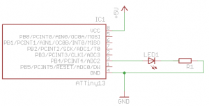

# The Compleat ATtiny13 LED Flasher: Part 2 - Using Timer Interrupts

*This is the second part of three in attempting to explain how to make the ATtiny13 flash a LED.*

- *Part 1: [Setup, Hardware and A Basic Solution](http://brownsofa.org/blog/archives/191)*
- ***Part 2: Using timer interrupts***
- *Part 3: [Low power mode](http://brownsofa.org/blog/archives/261)*

*~~Post-~~Pre-script: If you find this post useful, happen to try out the code, or have any other views or criticisms, please leave a comment. I’d love to hear what you think. – Ian*

So last time around, we made a LED flash.  Of course there are other, more elegant ways to do it.  In this post I’ll explore interrupts, and specifically the timer overflow interrupt.  For this I’ll use the same circuit setup from the first article.  If you’re reading this one independently, here’s a circuit diagram:

[](http://brownsofa.org/blog/wp-content/uploads/2011/01/LED-Flasher-Circuit.png)

## Interrupts

The structure of programs for these microcontrollers often takes a standard form:

```
#include <headers>

int main() {
   set_up_routine();

   while (1) {
      do_something_interesting();
   }
   return 1;
}
```

So once the code’s on the device, after power-up it enters `main()`, runs whatever setup you want to do, then begins running in an infinite loop doing whatever it is you want the tiny guy to do.

In this model, say you want to get input from devices, you must *poll* them – that is, every so often your program must go out of its way to figure out whether an input pin has changed from high to low, or some other measurement.  Now this can cause problems.  For example:

```
#include <headers>

int isSwitchPressed();      // returns 1 if switch is currently pressed down, 0 otherwise

int main() {
   set_up_routine();

   while (1) {
      if (isSwitchPressed()) {
         do_something_that_takes_a_long_time();
      }
   }
   return 1;
}
```

Let’s say that our interesting thing was to play a fancy little light sequence on a LED. You press the switch, the LED does its thing (or whatever else is in `do_something_that_takes_a_long_time`), that function returns and again we’re waiting for the switch to be pressed. This is all well and good. If the switch is not pressed, the function returns false, the `if`’s body is not evaluated, the `while` loop ends and restarts, and the code tests whether the switch is pressed.

But here’s the rub. Consider:

```
#include <headers>

int isSwitchPressed();      // returns 1 if switch is currently pressed down, 0 otherwise

int main() {
   set_up_routine();

   while (1) {
      if (isSwitchPressed()) {
         do_something_that_takes_a_long_time();
      } else {
         do_something_else_that_takes_a_long_time();
      }
   }
   return 1;
}
```

If the switch is not pressed, `do_something_else_that_takes_a_long_time()` is executed. If you push the switch during the time this function is executing, nothing will happen. The microcontroller will not register that the switch was pressed, and you lose that event happening.

So what if you want a button press during `do_something_else_that_takes_a_long_time()` to run the regular `do_something_that_takes_a_long_time()` code? You could start testing the switch state in `do_something_else_that_takes_a_long_time`. No, just kidding. That would suck.

This is where *interrupts* come into play. They do what you might expect them to do – they interrupt the normal code execution. Interrupts can be triggered by different types of events. In the example above you may recognize that a hardware-based interrupt might come to the rescue. Interrupts can also be generated by the microcontroller’s own internal systems, or by your code itself. These are called *interrupt vectors*. A list of the interrupt vectors for the ATtiny13 is listed in §9.1 in the [ATtiny13 datasheet](http://www.atmel.com/dyn/resources/prod_documents/doc8126.pdf) (p. 45).

When an interrupt happens, your way to instruct the µc to do something is through an interrupt handler, aka interrupt service routine, aka ISR. It looks just like a regular function, but you don’t call it directly from your code; it gets executed whenever an interrupt occurs. Once your ISR has completed execution, the program counter jumps back to right where it left of from in your `main()` loop (or wherever it was when the interrupt was raised) and carries on running.

More pseudocode:

```
#include <headers>

ISR(interrupt_vector_caused_by_switch_press) {
   do_something_that_takes_a_long_time();
}

int main() {
   set_up_routine();

   while (1) {
      do_something_else_that_takes_a_long_time();
   }
   return 1;
}
```

So if the button is pressed, and interrupt is raised and our ISR is called. No matter where the program counter is when you press the button, `do_something_that_takes_a_long_time()` will get called within a few clock cycles. If you haven’t pressed the button then all that gets executed is `do_something_else_that_takes_a_long_time()`.

OK, you get it, enough theory and pseudocode. Moving on…

*A word of warning: interrupts give you ways to do all kinds of weird things. Check out [this](http://www.societyofrobots.com/member_tutorials/node/207) and [this](http://greatengineering.net/Embedded-System-Engineering/Implementation/Interrupt-Race-Conditions.html) for just a hint of the perils that await you!*

## Implementing Interrupts on ATtiny13 with AVR Libc

_There’s more than one way to skin a cat.  My preferred method is using the [AVR Libc](http://www.nongnu.org/avr-libc/user-manual/index.html) code, and the avr-gcc C compiler toolchain, and that’s exclusively what I’ll focus on. _

I’m getting down to brass tacks and jumping around the [datasheet](http://www.atmel.com/dyn/resources/prod_documents/doc8126.pdf) a bit here.

The ATtiny13 datasheet §9.1 lists the *Timer/Counter Overflow* interrupt vector.  Then reading §11.7.1, you learn that in its normal mode, the counter counts upwards, and once it gets to the “top” (there’s only so many bits allocated to store the counter value) it resets back to zero and the `TOV0` bit is set. §11.9.6 says that if you enable the Timer/Counter0 Overflow Interrupt by setting the `TOIE0` bit to 1 in the `TIMSK0` register and interrupts are enabled (“the I-bit in the Status Register is set”), whenever the `TOV0` bit is set, the interrupt will be raised.

The timer is what we’re using to generate our interrupts.  It’s an 8-bit register, incremented once per clock tick (unless prescaled – see later).  Since it’s only an 8-bit register its maximum value is 255, therefore once every 256 clock cycles the timer reaches its maximum value and resets back to zero.  If we set up the device properly, when this occurs the Timer/Counter0 Overflow Interrupt will be generated, and we can write a ISR to respond to this interrupt, and flash our timer.

“256 clock cycles?” I hear you ask.  ”That’s not very long.“  We could add a counter variable and toggle the LED once the counter reaches a certain number of overflows.  That might work. The clock runs at around 9.6MHz by default (§6.2.2) and is shipped with the clock freqeuncy divided by 8 (§6.4.2), therefore the 8-bit timer register will overflow ~4688 times per second. Using an 8-bit variable to count those would itself overflow 18 times per second, so we’d need to use a 16-bit variable instead. That gets us into the human timescale, but 65536/4688 gives us a maximum flash time of ~13 seconds. It might work, but there’s a yet more elegant way…

An alternative is to prescale the timer.  This has the effect of using 1 of every *n* clock ticks to increment the timer counter (§12.1).  You can choose from a number of slowdown factors, all of them are powers of two, and all are listed in the datasheet in §11.9.2, table 11-9.  The slowest rate we can make the timer increment is at 1/1024th the rate of the main system clock (by setting `CS02` and `CS00` bits to 1 in the `TCCR0B` register).

If prescaling by x1024, the timer register gets incremented at 1.2MHz/1024, i.e. ~1172 times per second, and thus overflows 4.6 times per second. We could use an 8-bit variable to count the overflows and get a maximum of just under 56 seconds for that one little `uint`. Sounds better to me.

Here’s a little pseudocode to encapsulate this so far:

```
ISR(timer_overflow_vector) {
   if (timer_overflow_count > 5) {   // a timer overflow occurs 4.6 times per second
      toggle_led();
      reset_timer_overflow_count();
   }
}

main() {
   initialize_io_port();
   prescale_timer();
   enable_timer_overflow_interrupt();

   while(1) {
      // let ISR handle the LED forever
   }
}
```

Some of this is gravy, so let’s fill those in with more realistic code:

```
volatile int timer_overflow_count = 0;

ISR(timer_overflow_vector) {      // TODO
   if (++timer_overflow_count > 5) {   // a timer overflow occurs 4.6 times per second
      // Toggle Port B pin 4 output state
      PORTB ^= 1<<PB4;
      timer_overflow_count = 0;
   }
}

int main(void) {
   // Set up Port B pin 4 mode to output
    DDRB = 1<<DDB4;

   prescale_timer();   // TODO
   enable_timer_overflow_interrupt();   // TODO

   while(1) {
      // let ISR handle the LED forever
   }
}
```

A little insight from [avr-libc](http://www.nongnu.org/avr-libc/user-manual/group__avr__interrupts.html) helps with the interrupts. By including `avr/interrupt.h`, the ATtiny13’s Timer/Counter0 Overflow is exposed through the `TIM0_OVF_vect` interrupt vector. Thus:

```
#include <avr/interrupt.h>

volatile int timer_overflow_count = 0;

ISR(TIM0_OVF_vect) {
   if (++timer_overflow_count > 5) {   // a timer overflow occurs 4.6 times per second
      // Toggle Port B pin 4 output state
      PORTB ^= 1<<PB4;
      timer_overflow_count = 0;
   }
}

int main(void) {
   // Set up Port B pin 4 mode to output
    DDRB = 1<<DDB4;

   prescale_timer();   // TODO
   enable_timer_overflow_interrupt();   // TODO

   while(1) {
      // let ISR handle the LED forever
   }
}
```

Prescaling the timer is straightforward and straight from the datasheet: `TCCR0B |= (1<. Setting up the timer overflow interrupt was also defined in the datasheet: `TIMSK0 |=1<, and the `sei` instruction has a helpful `sei()` macro defined in `avr/interrupt.h`. Consolidating for our final code:

```
#include <avr/interrupt.h>

volatile int timer_overflow_count = 0;

ISR(TIM0_OVF_vect) {
   if (++timer_overflow_count > 5) {   // a timer overflow occurs 4.6 times per second
      // Toggle Port B pin 4 output state
      PORTB ^= 1<<PB4;
      timer_overflow_count = 0;
   }
}

int main(void) {
   // Set up Port B pin 4 mode to output
    DDRB = 1<<DDB4;

   // prescale timer to 1/1024th the clock rate
   TCCR0B |= (1<<CS02) | (1<<CS00);

   // enable timer overflow interrupt
   TIMSK0 |=1<<TOIE0;
   sei();

   while(1) {
      // let ISR handle the LED forever
   }
}
```

**References/Acknowledgements:** I have to point out the complete awesomeness and of Dean’s [Newbie’s Guide to AVR Interrupts](http://www.avrfreaks.net/index.php?name=PNphpBB2&file=viewtopic&t=89843&start=0&postdays=0&postorder=asc&highlight=) on [http://www.avrfreaks.net](http://www.avrfreaks.net/).  It’s awesome.  If you want a great explanation of interrupts, go there and read his tut.

Continue reading [part 3](http://brownsofa.org/blog/archives/261) to see how to use these techniques plus sleep modes to save battery power, or review the [previous section](http://brownsofa.org/blog/archives/191).