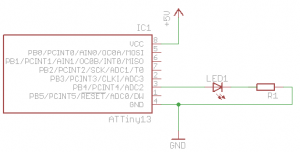
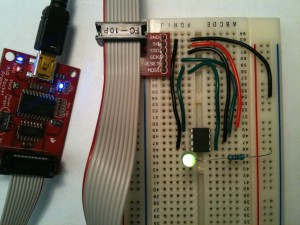

# The Compleat ATtiny13 LED Flasher: Part 3 - Low Power Mode

*This is the final part of three in attempting to explain how to make the ATtiny13 flash a LED.*

- *Part 1: [Setup, Hardware and A Basic Solution](http://brownsofa.org/blog/archives/191)*
- *Part 2: [Using timer interrupts](http://brownsofa.org/blog/archives/215)*
- ***Part 3: Low power mode***

In previous posts we’ve looked at creating a simple LED flasher circuit for the ATtiny, a first-pass program for the ATtiny using delays, and a second-pass implementation exploiting timer overflows resulting in a simpler program. In this article I will explore the power saving modes on the ATtiny13 as an example of how to minimize the power consumption of your circuit. If your ATTtiny13-, ATtiny80-, or even ATmega-based circuit relies on battery power you will be able to significantly improve the battery life by using the chips’ power saving modes.

In this article we will be using the same circuit developed in the [previous](http://brownsofa.org/blog/archives/191) [posts](http://brownsofa.org/blog/archives/215):

[](http://brownsofa.org/blog/wp-content/uploads/2011/01/LED-Flasher-Circuit.png)[](http://brownsofa.org/blog/wp-content/uploads/2011/01/board.jpg)

## Overview

Looking at the first page of the [datasheet](http://www.atmel.com/dyn/resources/prod_documents/doc8126.pdf) you see it lists “Low Power Idle, ADC Noise Reduction, and Power-down Modes”. Also looking at the [modules list](http://www.nongnu.org/avr-libc/user-manual/modules.html) in the avr-libc documentation there’s an entry for “[: Power Management and Sleep Modes](http://www.nongnu.org/avr-libc/user-manual/group__avr__sleep.html)”. Starting with example code from the latter, putting the device to sleep doesn’t look very hard:

```
#include <avr/sleep.h>

    ...
      set_sleep_mode(<mode>);
      sleep_mode();
```

Then immediately following is this note: “[…] unless your purpose is to completely lock the CPU (until a hardware reset), interrupts need to be enabled before going to sleep.”

So here are my questions: What are the sleep modes and what do they do? What interrupt vector(s) are available and how do I enable them?

In the datasheet, §7 covers the sleep modes. Right at the top, Table 7-1 summarizes which clocks and oscillators are active, and how the device can be awaken from each of the three supported sleep modes. Looking at §7.1.1-3, the lowest power consumption sleep mode looks like “Power Down Mode” (no surprise), and once in that state it can be awoken by an external interrupt (i.e. a level change on a pin) or through the Watchdog Timer.

Looking at §8.4, the Watchdog timer (WDT) is a separately clocked counter/timer system, capable of generating interrupts which we can use to bring the device out of the Power Down sleep mode. §8.5.2 details the WDT’s register, and in particular Table 8-2 lists how to alter the length of the WDT’s time period.

## Implementation

We’ve sen that there’s a way to put the device to sleep, and a way to periodically wake it up.  Last time our LED flasher toggled its LED state each time a timer-based interrupt was generated.  Let’s do the same thing, except put the device to sleep once the LED state has been toggled.  Hopefully this will reduce the power consumption overall, but mainly during the “off” part of the cycle.

Our last implementation using Timer/Counter0 looked like this:

```
#include <avr/interrupt.h>

volatile int timer_overflow_count = 0;

ISR(TIM0_OVF_vect) {
   if (++timer_overflow_count > 5) {   // a timer overflow occurs 4.6 times per second
      // Toggle Port B pin 4 output state
      PORTB ^= 1<<PB4;
      timer_overflow_count = 0;
   }
}

int main(void) {
   // Set up Port B pin 4 mode to output
    DDRB = 1<<DDB4;

   // prescale timer to 1/1024th the clock rate
   TCCR0B |= (1<<CS02) | (1<<CS00);

   // enable timer overflow interrupt
   TIMSK0 |=1<<TOIE0;
   sei();

   while(1) {
      // let ISR handle the LED forever
   }
}
```

We need to adjust the timer setup and interrupt we’re using, and add the power mode change. Working on the timer part first, we remove all references to Timer0, and replace them with set up for the WDT. Having read through §8.5.2 it’s clear that operating the WDT is very similar to Timer/Counter0. Setting the `WDTIE` bit enables WDT interrupts, and combinations of `WDP3`, `WDP2`, `WDP1`, and `WDP0` adjust the prescaling and thus the WDT’s period. Looking at Table 8-2, setting `WDP2` and `WDP0` gives a 0.5s timer period.

To wrap up replacing the older timer code, we also need to change the interrupt vector we’re using. The [documentation for interrupt.h](http://www.nongnu.org/avr-libc/user-manual/group__avr__interrupts.html) shows that this is called `WDT_vect`.

Finally, because we can prescale the timer this low, we can also dispense with our old overflow counter.

```
#include <avr/interrupt.h>

ISR(WDT_vect) {
   // Toggle Port B pin 4 output state
   PORTB ^= 1<<PB4;
}

int main(void) {
   // Set up Port B pin 4 mode to output
    DDRB = 1<<DDB4;

   // prescale timer to 0.5s
   WDTCR |= (1<<WDP2) | (1<<WDP0);

   // Enable watchdog timer interrupts
   WDTCR |= (1<<WDTIE);

   sei(); // Enable global interrupts 

   for (;;) {
      // Waiting for interrupt...
   }
}
```

If you set up the circuit and program this into the ATtiny13, the LED should flash on and off with a period of ~1 second, as you would expect. It might be interesting top find out what kind of power savings the sleep modes might give us, so before we add the sleep code let’s measure current drain right now. To make measurements a little easier slow down the flash rate by setting the prescaler to 4 seconds – `WDTCR |= (1< – then set your multimeter to measure current and put in the main power loop somewhere. For me the most convenient way was to break the connection between VCC on the ISP breakout and pin 8 on the ATtiny, and insert the ammeter there. I measured 50mA on the mark (whilst the LED was on), and 2.3mA on the space.

To put the device to sleep, the [documentation for sleep.h](http://www.nongnu.org/avr-libc/user-manual/group__avr__sleep.html) states that

```
set_sleep_mode(<mode>);
sleep_mode();
```

is all there is to it. But what parameter do we pass to `set_sleep_mode` to enable Power Down Mode? Since it’s not in this page of the documentation, if you take a look at the [code for the header file itself](http://www.nongnu.org/avr-libc/user-manual/sleep_8h_source.html), at line 253 there’s a #define for `SLEEP_MODE_PWR_DOWN` that’s applicable to ATtiny13s.

We have already set up the WDT to wake the device from sleep when it raises an interrupt, so as soon as the interrupt handler is complete it is safe to go back to sleep. Working this in, our code now looks like:

```
#include <avr/interrupt.h>
#include <avr/sleep.h>

ISR(WDT_vect) {
   // Toggle Port B pin 4 output state
   PORTB ^= 1<<PB4;
}

int main(void) {
   // Set up Port B pin 4 mode to output
    DDRB = 1<<DDB4;

   // temporarily prescale timer to 4s so we can measure current
   WDTCR |= (1<<WDP3); // (1<<WDP2) | (1<<WDP0);

   // Enable watchdog timer interrupts
   WDTCR |= (1<<WDTIE);

   sei(); // Enable global interrupts 

   // Use the Power Down sleep mode
   set_sleep_mode(SLEEP_MODE_PWR_DOWN);

   for (;;) {
      sleep_mode();   // go to sleep and wait for interrupt...
   }
}
```

Plugging in the ammeter again shows 47mA on the mark and 7µA on the space. These readings (and the previous set) are definitely within range of the typical DC characteristics shown in Table 18-1 in the datasheet. If you were using a CR1632 lithium coin cell rated at 125mAh, using the power down mode might increase battery life from 2.4h to 2.6h. Ok, that’s not fantastic but the huge majority of electron juice is used by the LED. If your circuit was a little more complex and had longer periods of inactivity, using the power down saves you a lot of power. If our LED were on for 1/10th of the time it were off, the battery duration change goes from an increase of 8% with the sleep code to an increase of **55%**, which seems well worth it to me.

## More Reading

For more ways to reduce power consumption, read §7.4 in the datasheet.

[Jumptuck’s](http://jumptuck.wordpress.com/) [LED Menorah](http://jumptuck.wordpress.com/2008/11/13/led-menorah-powered-by-avr-tiny13/) is a real-world example of using the sleep modes to reduce power consumption – in that case it’s to reduce power whilst the device is “off”.

Go back to [part 1](http://brownsofa.org/blog/archives/191) or [part 2](http://brownsofa.org/blog/archives/215).