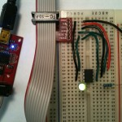
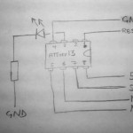
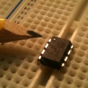
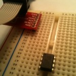
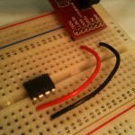
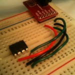
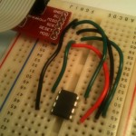
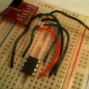
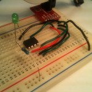

# The Compleat ATtiny13 LED Flasher: Part 1 - Setup, Hardware and a Basic Solution

*This is the first part of three in attempting to explain how to make the ATtiny13 flash a LED.*

- ***Part 1: Setup, Hardware and A Basic Solution***
- *Part 2: [Using Timer Interrupts](http://brownsofa.org/blog/archives/215)*
- *Part 3: [Low Power Mode](http://brownsofa.org/blog/archives/261)*

If you’re used to the user-friendliness of Arduino, getting started with bare bones AVRs can be hard work.  I’d like to try to go slowly through the early steps and point out some of the information sources I used.

[](http://brownsofa.org/blog/wp-content/uploads/2011/01/board.jpg)First, start at the end: here’s the final circuit.  It has an ATtiny13, an LED and current-limiting resistor, a few wires, the programmer interface, and that’s about it.  All it does is flash the LED on and off (very much like the classic 555 timer astable multivibrator but with the advantage of no passive components required).  That’s it.  Not much to it.

[](http://brownsofa.org/blog/wp-content/uploads/2011/01/photo.jpg)Also, here’s a quick sketch of a circuit diagram too – the inputs all come directly from the ISP interface from the programmer.

Ok, that’s the end result.  Next: how to get there:

1. Prerequisites (hardware and software)
2. Build the circuit
3. Write code
4. Upload to microprocessor

## 

**Prerequisites**

You need a programmer (e.g. [Pocket Programmer](http://www.sparkfun.com/products/9231), Adafruit’s [USBtinyISP](http://www.adafruit.com/index.php?main_page=product_info&products_id=46), any number [of](http://www.pololu.com/catalog/product/1300) [others](http://hackaday.com/2010/05/15/minimalist-avr-programmer-is-just-fab/), or even [use](http://electronics.stackexchange.com/questions/33/arduino-as-avr-programmer) your [arduino](http://hackaday.com/2009/07/15/avr-isp-programming-via-arduino/)),  a way to interface your programmer to your computer (a USB cable would be normal), and a way to interface your programmer to the ATtiny (ISP headers are normal, and here’s a [picture of the pinout ](http://electronics.stackexchange.com/questions/33/arduino-as-avr-programmer/71#71)of the 6-pin header).

Software-wise, there are also myriad choices.  There are different solutions for [Windows](http://www.google.com/search?q=program+avr+with+windows), [Mac ](http://www.google.com/search?q=program+avr+with+mac)and [Linux](http://www.google.com/search?q=program+avr+with+linux).  I’ve only tried a couple of Windows options to date.

Since there are so many options, I’d recommend finding a set of hardware and software that matches your existing equipment and budget that has a decent amount of documentation for troubleshooting.  If you can’t find much out about how to get programmer X working on your computer, try another programmer.

There are more detailed instructions about my tool chain for compiling and programming the chip in the [dice post](http://brownsofa.org/blog/archives/50).  I’m using a [Pocket Programmer](http://www.sparkfun.com/products/9231), and [WinAVR](http://winavr.sourceforge.net/).

**Build** Plug the microprocessor into your breadboard.  There’s a notch or a dot at one end of the package to indicate the top, or the position of pin 1 (pointed to in the photo).  Pay attention to which way round the chip is!  The rest of the pins are numbered counter-clockwise from pin 1.

[](http://brownsofa.org/blog/wp-content/uploads/2011/01/1.jpg)

If you have a nice [breakout board](http://www.sparkfun.com/products/8508) for your ISP connector, plug it into the breadboard, and start working from that.  Otherwise, refer to the [pinout ](http://electronics.stackexchange.com/questions/33/arduino-as-avr-programmer/71#71)for the ISP and plug wires directly into the socket.

[](http://brownsofa.org/blog/wp-content/uploads/2011/01/2.jpg)

Connect each of the signals from the programmer to your ATtiny – each of MISO, MOSI, SCK, GND, VCC and RESET.  Look at the [datasheet for the ATtiny13](http://www.atmel.com/dyn/resources/prod_documents/doc8126.pdf)to see the pinout  (page 2).

(I have a printout of tinkerlog.com’s [microcontroller cheat sheet](http://tinkerlog.com/2009/06/18/microcontroller-cheat-sheet/) on my desk.  It has pinouts of most common ATtiny and ATmega chips, and ISP headers, and I’m constantly referring to it.)

[](http://brownsofa.org/blog/wp-content/uploads/2011/01/3.jpg)[](http://brownsofa.org/blog/wp-content/uploads/2011/01/4.jpg)*[](http://brownsofa.org/blog/wp-content/uploads/2011/01/5.jpg)*

I want to source current for the LED from the ATtiny, and sink it to ground, so connect a supply line on the edge of the breadboard to GND from the ISP.

[](http://brownsofa.org/blog/wp-content/uploads/2011/01/6.jpg)

Connect the long lead of the LED to pin 3 of the ATtiny.  Connect the short pin to an empty row.  Into that row, connect the resistor (100 or 200 ohms should be fine) and then finally connect the other leg of the resistor to the ground channel.

[](http://brownsofa.org/blog/wp-content/uploads/2011/01/7.jpg)

**Write the code**

Paste this into your code editor:

```
/*
 * ATtiny13 LED Flasher
 * File: main.c
 */

#include <stdlib.h>
#include <util/delay.h>

int main(void)
{
    const int msecsDelayPost = 100;

    // Set up Port B pin 4 mode to output
    DDRB = 1<<DDB4;

    // Set up Port B data to be all low
    PORTB = 0;  

    while (1) {
        // Toggle Port B pin 4 output state
        PORTB ^= 1<<PB4;

        // Pause a little while
        _delay_ms (msecsDelayPost);
    }

    return 0;
}
```

Simple enough.  Save the file as main.c, generate or customize a makefile, and at a command prompt type `make all`. You should see something like the following:

```
D:\Projects\AVR>make all

-------- begin --------
avr-gcc (WinAVR 20100110) 4.3.3
Copyright (C) 2008 Free Software Foundation, Inc.
This is free software; see the source for copying conditions.  There is NO
warranty; not even for MERCHANTABILITY or FITNESS FOR A PARTICULAR PURPOSE.

Size before:
AVR Memory Usage
----------------
Device: attiny13

Program:      64 bytes (6.3% Full)
(.text + .data + .bootloader)

Data:          0 bytes (0.0% Full)
(.data + .bss + .noinit)

Compiling C: main.c
avr-gcc -c -mmcu=attiny13 -I. -gdwarf-2 -DF_CPU=1200000UL -Os -funsigned-char -f
unsigned-bitfields -fpack-struct -fshort-enums -Wall -Wstrict-prototypes -Wa,-ad
hlns=./main.lst  -std=gnu99 -MMD -MP -MF .dep/main.o.d main.c -o main.o

Linking: main.elf
avr-gcc -mmcu=attiny13 -I. -gdwarf-2 -DF_CPU=1200000UL -Os -funsigned-char -funs
igned-bitfields -fpack-struct -fshort-enums -Wall -Wstrict-prototypes -Wa,-adhln
s=main.o  -std=gnu99 -MMD -MP -MF .dep/main.elf.d main.o --output main.elf -Wl,-
Map=main.map,--cref     -lm

Creating load file for Flash: main.hex
avr-objcopy -O ihex -R .eeprom -R .fuse -R .lock -R .signature main.elf main.hex

Creating load file for EEPROM: main.eep
avr-objcopy -j .eeprom --set-section-flags=.eeprom="alloc,load" \
        --change-section-lma .eeprom=0 --no-change-warnings -O ihex main.elf mai
n.eep || exit 0

Creating Extended Listing: main.lss
avr-objdump -h -S -z main.elf > main.lss

Creating Symbol Table: main.sym
avr-nm -n main.elf > main.sym

Size after:
AVR Memory Usage
----------------
Device: attiny13

Program:      64 bytes (6.3% Full)
(.text + .data + .bootloader)

Data:          0 bytes (0.0% Full)
(.data + .bss + .noinit)

-------- end --------

D:\Projects\AVR>
```

**Upload to microprocessor**

Now the easy bit: plug the programmer into your computer, and type `make program`at the command prompt.  With any luck, you will see something like

```
D:\Projects\AVR>make program
avrdude -p attiny13 -P usb     -c usbtiny    -U flash:w:main.hex

avrdude: AVR device initialized and ready to accept instructions

Reading | ################################################## | 100% 0.34s

avrdude: Device signature = 0x1e9007
avrdude: NOTE: FLASH memory has been specified, an erase cycle will be performed

         To disable this feature, specify the -D option.
avrdude: erasing chip
avrdude: reading input file "main.hex"
avrdude: input file main.hex auto detected as Intel Hex
avrdude: writing flash (64 bytes):

Writing | ################################################## | 100% 0.27s

avrdude: 64 bytes of flash written
avrdude: verifying flash memory against main.hex:
avrdude: load data flash data from input file main.hex:
avrdude: input file main.hex auto detected as Intel Hex
avrdude: input file main.hex contains 64 bytes
avrdude: reading on-chip flash data:

Reading | ################################################## | 100% 0.05s

avrdude: verifying ...
avrdude: 64 bytes of flash verified

avrdude: safemode: Fuses OK

avrdude done.  Thank you.

D:\Projects\AVR>
```

…and the LED should start flashing!

Continue reading [part 2](http://brownsofa.org/blog/archives/215) to see how to achieve the same results by using timer interrupts.