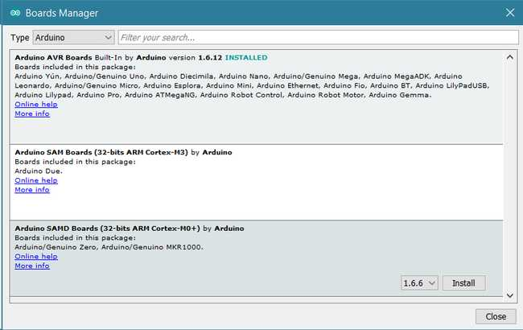
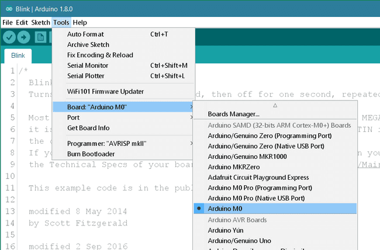
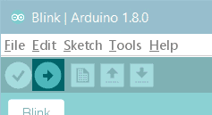
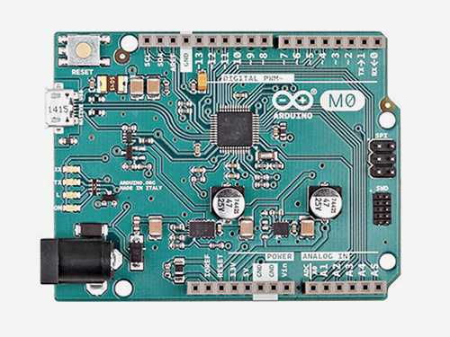

https://docs.arduino.cc/retired/getting-started-guides/ArduinoM0

This board is a simple and powerful 32-bit extension of the platform established by the UNO. Learn how to prepare your computer with all you need to start making your own projects. 

# Support for Arduino IDE

## install board support in arduino ide

 If you want to program your Arduino M0 while offline you need to install the [Arduino Desktop IDE](https://docs.arduino.cc/en/Main/Software) and add the Arduino(Atmel) SAMD Core to it. This simple procedure is done selecting **Tools menu**, then **Boards** and last **Boards Manager**, as documented in the [Arduino Boards Manager](https://docs.arduino.cc/en/Guide/Cores) page. 

  

## Installing Drivers for the M0

**OSX** No driver installation is necessary on OSX. Depending on the version of the OS you're running, you may get a dialog box asking you if you wish to open the "Network Preferences". Click the "Network Preferences..." button, then click "Apply". The M0will show up as "Not Configured", but it is still working. You can quit the System Preferences.

**Windows (tested on XP, 7, Vista and 10)** Connect the M0 to your computer with a USB cable via the USB Native port. Windows should initiate its automatic driver installation process once the board is plugged in. When the process is complete, you should find in the Device Manager a port listing similar to "Arduino M0 Native Port (COM4)" If you have multiple COM devices, the M0 will probably be the COM port with the largest number.

**Linux** No driver installation is necessary for Linux.


# Quick start

## Open your first sketch

Open the LED blink example sketch: **File > Examples >01.Basics > Blink**.

[](https://docs.arduino.cc/static/769176014865d9e2b5255b4f4f6dcff2/7763a/UNO_Load_Blink.jpg)

## Select your board type and port

You'll need to select the entry in the **Tools > Board** menu that corresponds to your Arduino board.

[](https://docs.arduino.cc/static/c697c963f4b2bdb362c67cb1fae6e910/71c8e/Arduino_M0_board.png)

Select the serial device of the board from the Tools | Serial Port menu. This is likely to be **COM3** or higher (**COM1** and **COM2** are usually reserved for hardware serial ports). To find out, you can disconnect your board and re-open the menu; the entry that disappears should be the Arduino board. Reconnect the board and select that serial port.

## Upload the program

Now, simply click the "Upload" button in the environment. Wait a few seconds - you should see the RX and TX leds on the board flashing. If the upload is successful, the message "Done uploading." will appear in the status bar.

[](https://docs.arduino.cc/static/0bd943210336ba4022b1b4e493775d82/008e2/UNO_Upload.png)

A few seconds after the upload finishes, you should see the on-board LED start to blink (in orange). If it does, congratulations! You've gotten your M0 board up-and-running. If you have problems, please see the [troubleshooting suggestions](https://docs.arduino.cc/en/Guide/Troubleshooting).


# Please Read...

The microcontroller on the M0 runs at 3.3V, which means that you must never apply more than 3.3V to its inputs or outputs. Care must be taken when connecting sensors and actuators to assure that this is never exceeded. **Connecting higher voltages, like the 5V commonly used with the other Arduino boards, will damage the M0.**


# Serial ports on the M0

[](https://docs.arduino.cc/static/f85a076648d177fe68fbafda647af092/41099/ArduinoM0.jpg)

The M0 has **one USB port available**. The *Native* USB port (which supports CDC serial communication using the *SerialUSB* object) is connected directly to the SAMD21 MCU.

The USB connector of the *Native* port is directly connected to the USB host pins of the SAMD21. Using the *Native* port enables you to use the M0 as a client USB peripheral (acting as a mouse or a keyboard connected to the computer) or as a USB host device so that devices can be connected to the M0 (like a mouse, keyboard, or an Android phone). This port can also be used as a virtual serial port using the "SerialUSB" object in the Arduino programming language.

## Native port

Opening and closing the *Native* port at the **baud rate of 1200bps triggers a "soft erase" procedure**: the flash memory is erased and the board is restarted with the bootloader. This procedure is managed by the MCU, so if the MCU is interrupted for any reason, it is likely that the soft erase procedure would fail.

Opening and closing the *Native* port at a baudrate other than 1200bps will not reset the SAMD21. To use the serial monitor, and see what your sketch does from the beginning, you'll need to add few lines of code inside the setup(). This will ensure the SAMD21 will wait for the SerialUSB port to open before executing the sketch:

```c
while (!Serial) ;
```

Pressing the Reset button on the M0 causes the SAMD21 to reset as well as resetting the USB communication. This interruption means that if the serial monitor is open, it's necessary to close and reopen it to restart the communication.

