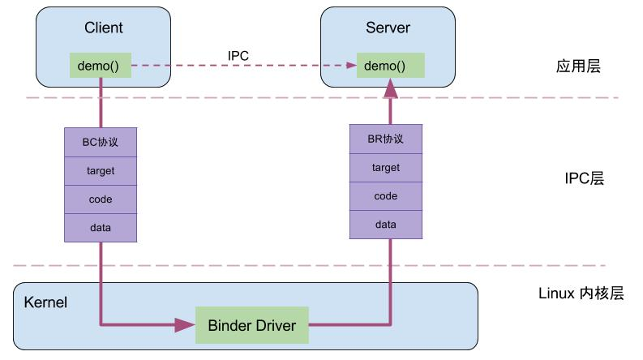
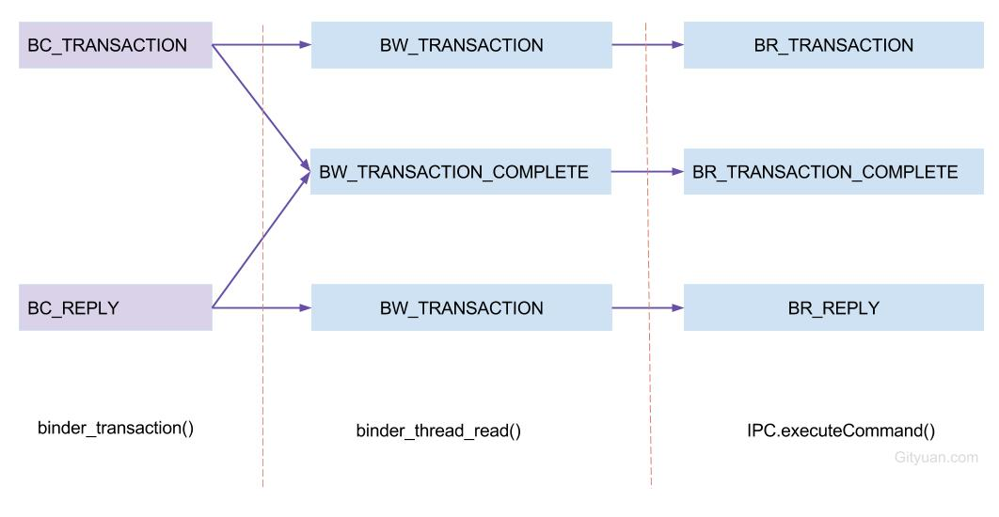
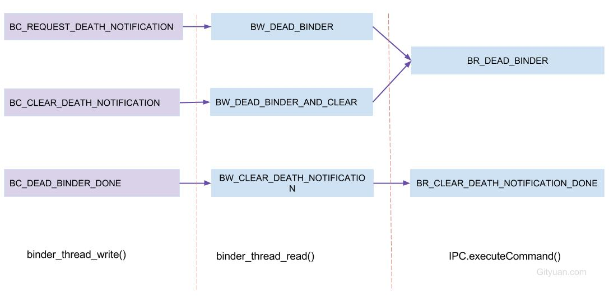
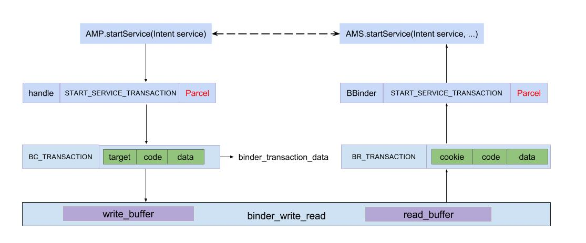
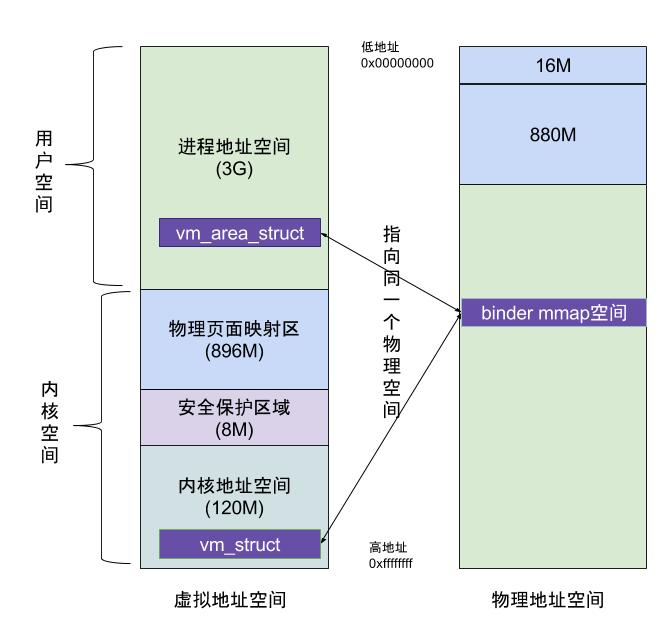
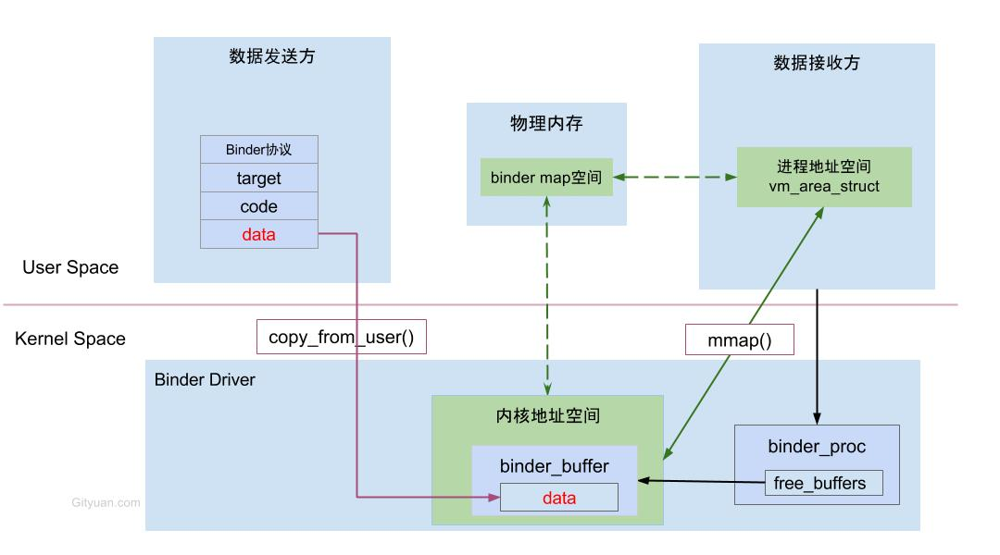

> > 基于Android 6.0的源码剖析，在讲解Binder原理之前，先从kernel的角度来讲解Binder Driver.
>
> ## 一、Binder通信简述
>
> 上一篇文章[Binder Driver初探](http://gityuan.com/2015/11/01/binder-driver/)介绍了Binder驱动的`init`、`open`、`mmap`、`ioctl`这4个核心方法，并说明与Binder相关的常见结构体。
>
> Client进程通过RPC(Remote Procedure Call Protocol)与Server通信，可以简单地划分为三层，驱动层、IPC层、业务层。`demo()`便是Client端和Server共同协商好的统一方法；handle、RPC数据、代码、协议这4项组成了IPC层的数据，通过IPC层进行数据传输；而真正在Client和Server两端建立通信的基础设施便是Binder Driver。
>
> 
>
> 例如，当名为`BatteryStatsService`的Client向ServiceManager注册服务的过程中，IPC层的数据组成为：`Handle=0`，RPC代码为`ADD_SERVICE_TRANSACTION`，RPC数据为`BatteryStatsService`，Binder协议为`BC_TRANSACTION`。
>
> ## 二、Binder通信协议
>
> ### 2.1 通信模型
>
> 先列举一次完整的Binder通信过程：
>
> 
>
> Binder协议包含在IPC数据中，分为两类:
>
> 1. `BINDER_COMMAND_PROTOCOL`：binder请求码，以”BC_“开头，简称BC码，用于从IPC层传递到Binder Driver层；
> 2. `BINDER_RETURN_PROTOCOL` ：binder响应码，以”BR_“开头，简称BR码，用于从Binder Driver层传递到IPC层；
>
> Binder IPC通信至少是两个进程的交互：
>
> - client进程执行binder_thread_write，根据BC_XXX命令，生成相应的binder_work；
> - server进程执行binder_thread_read，根据binder_work.type类型，生成BR_XXX，发送到用户空间处理。
>
> #### 2.1.1 通信过程
>
> 
>
> 其中binder_work.type共有6种类型：
>
> ```
> BINDER_WORK_TRANSACTION //最常见类型
> BINDER_WORK_TRANSACTION_COMPLETE
> BINDER_WORK_NODE
> BINDER_WORK_DEAD_BINDER
> BINDER_WORK_DEAD_BINDER_AND_CLEAR
> BINDER_WORK_CLEAR_DEATH_NOTIFICATION
> ```
>
> ### 2.2 binder_thread_write
>
> 请求处理过程是通过`binder_thread_write()`方法，该方法用于处理Binder协议中的请求码。当binder_buffer存在数据，binder线程的写操作循环执行。
>
> ```
> binder_thread_write(){
>     while (ptr < end && thread->return_error == BR_OK) {
>         get_user(cmd, (uint32_t __user *)ptr)；//获取IPC数据中的Binder协议(BC码)
>         switch (cmd) {
>             case BC_INCREFS: ...
>             case BC_ACQUIRE: ...
>             case BC_RELEASE: ...
>             case BC_DECREFS: ...
>             case BC_INCREFS_DONE: ...
>             case BC_ACQUIRE_DONE: ...
>             case BC_FREE_BUFFER: ... break;
>             
>             case BC_TRANSACTION:
>             case BC_REPLY: {
>                 struct binder_transaction_data tr;
>                 copy_from_user(&tr, ptr, sizeof(tr))； //拷贝用户空间tr到内核
>                 // 【见小节2.2.1】
>                 binder_transaction(proc, thread, &tr, cmd == BC_REPLY);
>                 break;
> 
>             case BC_REGISTER_LOOPER: ...
>             case BC_ENTER_LOOPER: ...
>             case BC_EXIT_LOOPER: ...
>             case BC_REQUEST_DEATH_NOTIFICATION: ...
>             case BC_CLEAR_DEATH_NOTIFICATION:  ...
>             case BC_DEAD_BINDER_DONE: ...
>             }
>         }
>     }
> }
> ```
>
> 对于请求码为`BC_TRANSACTION`或`BC_REPLY`时，会执行binder_transaction()方法，这是最为频繁的操作。 对于其他命令则不同。
>
> #### 2.2.1 binder_transaction
>
> ```
> static void binder_transaction(struct binder_proc *proc,
>                struct binder_thread *thread,
>                struct binder_transaction_data *tr, int reply){
>     //根据各种判定，获取以下信息：
>     struct binder_thread *target_thread； //目标线程
>     struct binder_proc *target_proc；    //目标进程
>     struct binder_node *target_node；    //目标binder节点
>     struct list_head *target_list；      //目标TODO队列
>     wait_queue_head_t *target_wait；     //目标等待队列
>     ...
>     
>     //分配两个结构体内存
>     struct binder_transaction *t = kzalloc(sizeof(*t), GFP_KERNEL);
>     struct binder_work *tcomplete = kzalloc(sizeof(*tcomplete), GFP_KERNEL);
>     //从target_proc分配一块buffer【见小节3.2】
>     t->buffer = binder_alloc_buf(target_proc, tr->data_size,
> 
>     for (; offp < off_end; offp++) {
>         switch (fp->type) {
>         case BINDER_TYPE_BINDER: ...
>         case BINDER_TYPE_WEAK_BINDER: ...
>         case BINDER_TYPE_HANDLE: ...
>         case BINDER_TYPE_WEAK_HANDLE: ...
>         case BINDER_TYPE_FD: ...
>         }
>     }
>     //向目标进程的target_list添加BINDER_WORK_TRANSACTION事务
>     t->work.type = BINDER_WORK_TRANSACTION;
>     list_add_tail(&t->work.entry, target_list);
>     //向当前线程的todo队列添加BINDER_WORK_TRANSACTION_COMPLETE事务
>     tcomplete->type = BINDER_WORK_TRANSACTION_COMPLETE;
>     list_add_tail(&tcomplete->entry, &thread->todo);
>     if (target_wait)
>         wake_up_interruptible(target_wait);
>     return;
> }
> ```
>
> 路由过程：handle -> ref -> target_node -> target_proc
>
> - reply的过程会找到target_thread；
> - 非reply则一般找到target_proc；
> - 对特殊的嵌套binder call会根据transaction_stack来决定是插入事务到目标线程还是目标进程。
>
> #### 2.2.2 BC_PROTOCOL
>
> binder请求码，是用`enum binder_driver_command_protocol`来定义的，是用于应用程序向binder驱动设备发送请求消息，应用程序包含Client端和Server端，以BC_开头，总17条；(-代表目前不支持的请求码)
>
> | 请求码                        | 参数类型                | 作用                           |
> | :---------------------------- | :---------------------- | :----------------------------- |
> | BC_TRANSACTION                | binder_transaction_data | Client向Binder驱动发送请求数据 |
> | BC_REPLY                      | binder_transaction_data | Server向Binder驱动发送请求数据 |
> | BC_FREE_BUFFER                | binder_uintptr_t(指针)  | 释放内存                       |
> | BC_INCREFS                    | __u32(descriptor)       | binder_ref弱引用加1操作        |
> | BC_DECREFS                    | __u32(descriptor)       | binder_ref弱引用减1操作        |
> | BC_ACQUIRE                    | __u32(descriptor)       | binder_ref强引用加1操作        |
> | BC_RELEASE                    | __u32(descriptor)       | binder_ref强引用减1操作        |
> | BC_ACQUIRE_DONE               | binder_ptr_cookie       | binder_node强引用减1操作       |
> | BC_INCREFS_DONE               | binder_ptr_cookie       | binder_node弱引用减1操作       |
> | BC_REGISTER_LOOPER            | 无参数                  | 创建新的looper线程             |
> | BC_ENTER_LOOPER               | 无参数                  | 应用线程进入looper             |
> | BC_EXIT_LOOPER                | 无参数                  | 应用线程退出looper             |
> | BC_REQUEST_DEATH_NOTIFICATION | binder_handle_cookie    | 注册死亡通知                   |
> | BC_CLEAR_DEATH_NOTIFICATION   | binder_handle_cookie    | 取消注册的死亡通知             |
> | BC_DEAD_BINDER_DONE           | binder_uintptr_t(指针)  | 已完成binder的死亡通知         |
> | BC_ACQUIRE_RESULT             | -                       | -                              |
> | BC_ATTEMPT_ACQUIRE            | -                       | -                              |
>
> 1. BC_FREE_BUFFER：
>    - 通过mmap()映射内存，其中ServiceManager映射的空间大小为128K，其他Binder应用进程映射的内存大小为1M-8K。
>    - Binder驱动基于这块映射的内存采用最佳匹配算法来动态分配和释放，通过[binder_buffer](http://gityuan.com/2015/11/01/binder-driver/#binderbuffer)结构体中的`free`字段来表示相应的buffer是空闲还是已分配状态。对于已分配的buffers加入到binder_proc中的allocated_buffers红黑树;对于空闲的buffers加入到binder_proc中的free_buffers红黑树。
>    - 当应用程序需要内存时，根据所需内存大小从free_buffers中找到最合适的内存，并放入allocated_buffers树；当应用程序处理完后必须尽快使用`BC_FREE_BUFFER`命令来释放该buffer，从而添加回到free_buffers树。
> 2. BC_INCREFS、BC_ACQUIRE、BC_RELEASE、BC_DECREFS等请求码的作用是对binder的强/弱引用的计数操作，用于实现强/弱指针的功能。
> 3. 参数类型主要有以下几类：
>    - binder_transaction_data（结构体）
>    - binder_ptr_cookie（由binder指针和cookie组成）
>    - binder_uintptr_t（指针）
>    - __u32（无符号整型）
> 4. Binder线程创建与退出：
>    - BC_ENTER_LOOPER：binder主线程(由应用层发起)的创建会向驱动发送该消息；joinThreadPool()过程创建binder主线程;
>    - BC_REGISTER_LOOPER：Binder用于驱动层决策而创建新的binder线程；joinThreadPool()过程,创建非binder主线程;
>    - BC_EXIT_LOOPER：退出Binder线程，对于binder主线程是不能退出;joinThreadPool()的过程出现timeout,并且非binder主线程,则会退出该binder线程;
>
> ### 2.3 binder_thread_read
>
> 响应处理过程是通过`binder_thread_read()`方法，该方法根据不同的`binder_work->type`以及不同状态，生成相应的响应码。
>
> ```
> binder_thread_read（）{
>     wait_for_proc_work = thread->transaction_stack == NULL &&
>             list_empty(&thread->todo);
>     //根据wait_for_proc_work来决定wait在当前线程还是进程的等待队列
>     if (wait_for_proc_work) {
>         ret = wait_event_freezable_exclusive(proc->wait, binder_has_proc_work(proc, thread));
>         ...
>     } else {
>         ret = wait_event_freezable(thread->wait, binder_has_thread_work(thread));
>         ...
>     }
>     
>     while (1) {
>         //当&thread->todo和&proc->todo都为空时，goto到retry标志处，否则往下执行：
>         struct binder_transaction_data tr;
>         struct binder_transaction *t = NULL;
>         switch (w->type) {
>           case BINDER_WORK_TRANSACTION: ...
>           case BINDER_WORK_TRANSACTION_COMPLETE: ...
>           case BINDER_WORK_NODE: ...
>           case BINDER_WORK_DEAD_BINDER: ...
>           case BINDER_WORK_DEAD_BINDER_AND_CLEAR: ...
>           case BINDER_WORK_CLEAR_DEATH_NOTIFICATION: ...
>         }
>         ...
>     }
> done:
>     *consumed = ptr - buffer;
>     //当满足请求线程加已准备线程数等于0，已启动线程数小于最大线程数(15)，
>     //且looper状态为已注册或已进入时创建新的线程。
>     if (proc->requested_threads + proc->ready_threads == 0 &&
>         proc->requested_threads_started < proc->max_threads &&
>         (thread->looper & (BINDER_LOOPER_STATE_REGISTERED |
>          BINDER_LOOPER_STATE_ENTERED))) {
>         proc->requested_threads++;
>         // 生成BR_SPAWN_LOOPER命令，用于创建新的线程
>         put_user(BR_SPAWN_LOOPER, (uint32_t __user *)buffer)；
>     }
>     return 0;
> }
> ```
>
> 说明：
>
> 当transaction堆栈为空，且线程todo链表为空，且non_block=false时，意味着没有任何事务需要处理的，会进入等待客户端请求的状态。当有事务需要处理时便会进入循环处理过程，并生成相应的响应码。在Binder驱动层，只有在进入binder_thread_read()方法时，同时满足以下条件， 才会生成`BR_SPAWN_LOOPER`命令，当用户态进程收到该命令则会创建新线程：
>
> 1. binder_proc的requested_threads线程数为0；
> 2. binder_proc的ready_threads线程数为0；
> 3. binder_proc的requested_threads_started个数小于15(即最大线程个数)；
> 4. binder_thread的looper状态为BINDER_LOOPER_STATE_REGISTERED或BINDER_LOOPER_STATE_ENTERED。
>
> 那么在哪里处理响应码呢？ 通过前面的Binder通信协议图，可以知道处理响应码的过程是在用户态处理，即后续文章会讲到的用户空间IPCThreadState类中的[IPCThreadState::waitForResponse()](http://gityuan.com/2015/11/14/binder-add-service/#waitforresponse)和[IPCThreadState::executeCommand()](http://gityuan.com/2015/11/14/binder-add-service/#executecommand)两个方法共同处理Binder协议中的18个响应码。
>
> #### 2.3.1 BR_PROTOCOL
>
> binder响应码，是用`enum binder_driver_return_protocol`来定义的，是binder设备向应用程序回复的消息，，应用程序包含Client端和Server端，以BR_开头，总18条；
>
> | 响应码                           | 参数类型                | 作用                                        |
> | :------------------------------- | :---------------------- | :------------------------------------------ |
> | BR_ERROR                         | __s32                   | 操作发生错误                                |
> | BR_OK                            | 无参数                  | 操作完成                                    |
> | BR_NOOP                          | 无参数                  | 不做任何事                                  |
> | BR_SPAWN_LOOPER                  | 无参数                  | 创建新的Looper线程                          |
> | BR_TRANSACTION                   | binder_transaction_data | Binder驱动向Server端发送请求数据            |
> | BR_REPLY                         | binder_transaction_data | Binder驱动向Client端发送回复数据            |
> | BR_TRANSACTION_COMPLETE          | 无参数                  | 对请求发送的成功反馈                        |
> | BR_DEAD_REPLY                    | 无参数                  | 回复失败，往往是线程或节点为空              |
> | BR_FAILED_REPLY                  | 无参数                  | 回复失败，往往是transaction出错导致         |
> | BR_INCREFS                       | binder_ptr_cookie       | binder_ref弱引用加1操作（Server端）         |
> | BR_DECREFS                       | binder_ptr_cookie       | binder_ref弱引用减1操作（Server端）         |
> | BR_ACQUIRE                       | binder_ptr_cookie       | binder_ref强引用加1操作（Server端）         |
> | BR_RELEASE                       | binder_ptr_cookie       | binder_ref强引用减1操作（Server端）         |
> | BR_DEAD_BINDER                   | binder_uintptr_t(指针)  | Binder驱动向client端发送死亡通知            |
> | BR_CLEAR_DEATH_NOTIFICATION_DONE | binder_uintptr_t(指针)  | BC_CLEAR_DEATH_NOTIFICATION命令对应的响应码 |
> | BR_ACQUIRE_RESULT                | -                       | -                                           |
> | BR_ATTEMPT_ACQUIRE               | -                       | -                                           |
> | BR_FINISHED                      | -                       | -                                           |
>
> **BR_SPAWN_LOOPER**：binder驱动已经检测到进程中没有线程等待即将到来的事务。那么当一个进程接收到这条命令时，该进程必须创建一条新的服务线程并注册该线程，在接下来的响应过程会看到何时生成该响应码。
>
> **BR_TRANSACTION_COMPLETE**：当Client端向Binder驱动发送BC_TRANSACTION命令后，Client会收到BR_TRANSACTION_COMPLETE命令，告知Client端请求命令发送成功；对于Server向Binder驱动发送BC_REPLY命令后，Server端会收到BR_TRANSACTION_COMPLETE命令，告知Server端请求回应命令发送成功。
>
> **BR_DEAD_REPLY**: 当应用层向Binder驱动发送Binder调用时，若Binder应用层的另一个端已经死亡，则驱动回应BR_DEAD_BINDER命令。
>
> **BR_FAILED_REPLY**: 当应用层向Binder驱动发送Binder调用时，若transaction出错，比如调用的函数号不存在，则驱动回应BR_FAILED_REPLY。
>
> ## 三. 场景总结
>
> #### 3.1 BC协议使用场景
>
> | BC协议                        | 调用方法                       |
> | :---------------------------- | :----------------------------- |
> | BC_TRANSACTION                | IPC.transact()                 |
> | BC_REPLY                      | IPC.sendReply()                |
> | BC_FREE_BUFFER                | IPC.freeBuffer()               |
> | BC_REQUEST_DEATH_NOTIFICATION | IPC.requestDeathNotification() |
> | BC_CLEAR_DEATH_NOTIFICATION   | IPC.clearDeathNotification()   |
> | BC_DEAD_BINDER_DONE           | IPC.execute()                  |
>
> binder_thread_write()根据不同的BC协议而执行不同的流程。 其中BC_TRANSACTION和BC_REPLY协议，会进入binder_transaction()过程。
>
> #### 2.4.2 binder_work类型
>
> - BINDER_WORK_TRANSACTION
>   - binder_transaction()
>   - binder_release_work()
> - BINDER_WORK_TRANSACTION_COMPLETE
>   - binder_transaction()
>   - binder_release_work()
> - BINDER_WORK_NODE
>   - binder_new_node()
> - BINDER_WORK_DEAD_BINDER
>   - binder_thread_write()，收到BC_REQUEST_DEATH_NOTIFICATION
> - BINDER_WORK_DEAD_BINDER_AND_CLEAR
>   - binder_thread_write()，收到BC_CLEAR_DEATH_NOTIFICATION
> - BINDER_WORK_CLEAR_DEATH_NOTIFICATION
>   - binder_thread_write()，收到BC_CLEAR_DEATH_NOTIFICATION
>   - binder_thread_write()，收到BC_DEAD_BINDER_DONE
>
> #### 3.2 BR协议使用场景
>
> | BC协议                           | 触发时机                                                     |
> | :------------------------------- | :----------------------------------------------------------- |
> | BR_TRANSACTION                   | 收到BINDER_WORK_TRANSACTION                                  |
> | BR_REPLY                         | 收到BINDER_WORK_TRANSACTION                                  |
> | BR_TRANSACTION_COMPLETE          | 收到BINDER_WORK_TRANSACTION_COMPLETE                         |
> | BR_DEAD_BINDER                   | 收到BINDER_WORK_DEAD_BINDER或BINDER_WORK_DEAD_BINDER_AND_CLEAR |
> | BR_CLEAR_DEATH_NOTIFICATION_DONE | 收到BINDER_WORK_CLEAR_DEATH_NOTIFICATION                     |
>
> BR_DEAD_REPLY，BR_FAILED_REPLY，BR_ERROR这些都是失败或错误相关的应答协议
>
> #### 3.3 协议转换图
>
> 
>
> 
>
> 图解：(以BC_TRANSACTION为例)
>
> - 发起端进程：binder_transaction()过程将BC_TRANSACTION转换为BW_TRANSACTION；
> - 接收端进程：binder_thread_read()过程，将BW_TRANSACTION转换为BR_TRANSACTION;
> - 接收端进程：IPC.execute()过程，处理BR_TRANSACTION命令。
>
> 注：BINDER_WORK_xxx –> BW_xxx
>
> #### 3.4 数据转换图
>
> 
>
> 图(左)说明：
>
> - AMP.startService: 将数据封装到Parcel类型；
> - IPC.writeTransactionData：将数据封装到binder_transaction_data结构体；
> - IPC.talkWithDriver：将数据进一步封装到binder_write_read结构体；
>   - 再通过ioctl()写入命令BINDER_WRITE_READ和binder_write_read结构体到驱动层
> - binder_transaction: 将发起端数据拷贝到接收端进程的buffer结构体；
>
> 图(右)说明：
>
> - binder_thread_read：根据binder_transaction结构体和binder_buffer结构体数据生成新的binder_transaction_data结构体，写入bwr的write_buffer，传递到用户空间。
> - IPC.executeCommand: 解析binder_transaction_data数据，找到目标BBinder并调用其transact()方法;
> - AMN.onTransact： 解析Parcel数据，然后调用目标服务的目标方法；
> - AMS.startService： 层层封装和拆分后，执行真正的业务逻辑。
>
> ## 四、Binder内存机制
>
> 在上一篇文章从代码角度阐释了[binder_mmap()](http://gityuan.com/2015/11/01/binder-driver/#bindermmap)，这也是Binder进程间通信效率高的核心机制所在，如下图：
>
> 
>
> 虚拟进程地址空间(vm_area_struct)和虚拟内核地址空间(vm_struct)都映射到同一块物理内存空间。当Client端与Server端发送数据时，Client（作为数据发送端）先从自己的进程空间把IPC通信数据`copy_from_user`拷贝到内核空间，而Server端（作为数据接收端）与内核共享数据，不再需要拷贝数据，而是通过内存地址空间的偏移量，即可获悉内存地址，整个过程只发生一次内存拷贝。一般地做法，需要Client端进程空间拷贝到内核空间，再由内核空间拷贝到Server进程空间，会发生两次拷贝。
>
> 对于进程和内核虚拟地址映射到同一个物理内存的操作是发生在数据接收端，而数据发送端还是需要将用户态的数据复制到内核态。到此，可能有读者会好奇，为何不直接让发送端和接收端直接映射到同一个物理空间，那样就连一次复制的操作都不需要了，0次复制操作那就与Linux标准内核的共享内存的IPC机制没有区别了，对于共享内存虽然效率高，但是对于多进程的同步问题比较复杂，而管道/消息队列等IPC需要复制2两次，效率较低。这里就不先展开讨论Linux现有的各种IPC机制跟Binder的详细对比，总之Android选择Binder的基于速度和安全性的考虑。
>
> 下面这图是从Binder在进程间数据通信的流程图，从图中更能明了Binder的内存转移关系。
>
> 
>

