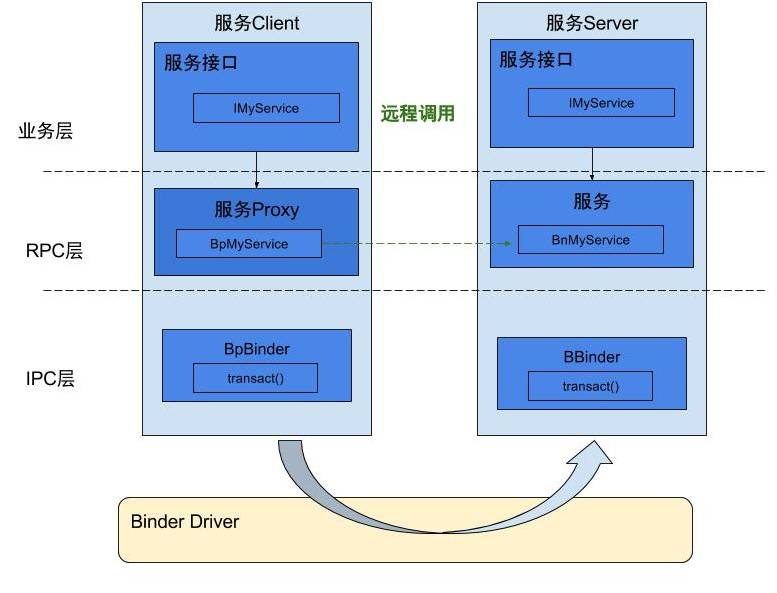
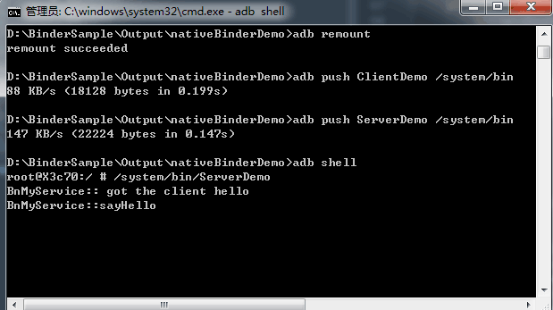
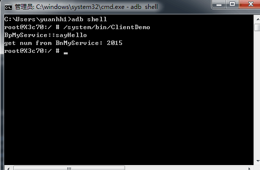
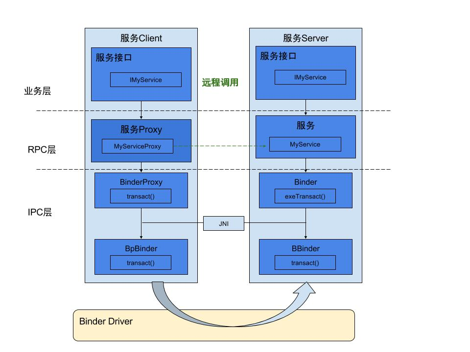
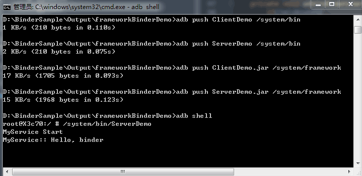
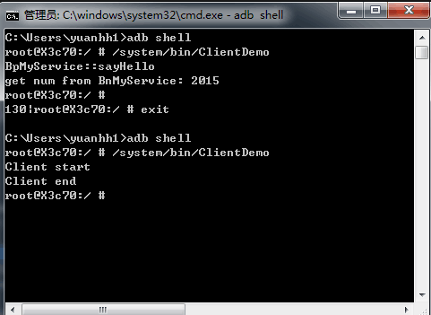

> 自定义binder架构的 client/ server组件

## 一、Native层Binder

源码结构：

- ClientDemo.cpp: 客户端程序
- ServerDemo.cpp：服务端程序
- IMyService.h：自定义的MyService服务的头文件
- IMyService.cpp：自定义的MyService服务
- Android.mk：源码build文件

### 1.1 服务端

```
#include "IMyService.h"
int main() {
    //获取service manager引用
    sp < IServiceManager > sm = defaultServiceManager();
    //注册名为"service.myservice"的服务到service manager
    sm->addService(String16("service.myservice"), new BnMyService());
    ProcessState::self()->startThreadPool(); //启动线程池
    IPCThreadState::self()->joinThreadPool(); //把主线程加入线程池
    return 0;
}
```

将名为”service.myservice”的BnMyService服务添加到ServiceManager，并启动服务

### 1.2 客户端

```
#include "IMyService.h"
int main() {
    //获取service manager引用
    sp < IServiceManager > sm = defaultServiceManager();
    //获取名为"service.myservice"的binder接口
    sp < IBinder > binder = sm->getService(String16("service.myservice"));
    //将biner对象转换为强引用类型的IMyService
    sp<IMyService> cs = interface_cast < IMyService > (binder);
    //利用binder引用调用远程sayHello()方法
    cs->sayHello();
    return 0;
}
```

获取名为”service.myservice”的服务，再进行类型，最后调用远程方法`sayHello()`

### 1.3 创建MyService

**(1)IMyService.h**

```
namespace android
{
    class IMyService : public IInterface
    {
    public:
        DECLARE_META_INTERFACE(MyService); //使用宏，申明MyService
        virtual void sayHello()=0; //定义方法
    };

    //定义命令字段
    enum
    {
        HELLO = 1,
    };

    //申明客户端BpMyService
    class BpMyService: public BpInterface<IMyService> {
    public:
        BpMyService(const sp<IBinder>& impl);
        virtual void sayHello();
    };

    //申明服务端BnMyService
    class BnMyService: public BnInterface<IMyService> {
    public:
        virtual status_t onTransact(uint32_t code, const Parcel& data, Parcel* reply, uint32_t flags = 0);
        virtual void sayHello();
    };
}
```

主要功能：

- 申明IMyService
- 申明BpMyService（Binder客户端）
- 申明BnMyService（Binder的服务端）

**(2)IMyService.cpp**

```
#include "IMyService.h"
namespace android
{
    //使用宏，完成MyService定义
    IMPLEMENT_META_INTERFACE(MyService, "android.demo.IMyService");

    //客户端
    BpMyService::BpMyService(const sp<IBinder>& impl) :
            BpInterface<IMyService>(impl) {
    }

    // 实现客户端sayHello方法
    void BpMyService::sayHello() {
        printf("BpMyService::sayHello\n");
        Parcel data, reply;
        data.writeInterfaceToken(IMyService::getInterfaceDescriptor());
        remote()->transact(HELLO, data, &reply);
        printf("get num from BnMyService: %d\n", reply.readInt32());
    }

    //服务端，接收远程消息，处理onTransact方法
    status_t BnMyService::onTransact(uint_t code, const Parcel& data,
            Parcel* reply, uint32_t flags) {
        switch (code) {
        case HELLO: {    //收到HELLO命令的处理流程
            printf("BnMyService:: got the client hello\n");
            CHECK_INTERFACE(IMyService, data, reply);
            sayHello();
            reply->writeInt32(2015);
            return NO_ERROR;
        }
            break;
        default:
            break;
        }
        return NO_ERROR;
    }

    // 实现服务端sayHello方法
    void BnMyService::sayHello() {
        printf("BnMyService::sayHello\n");
    };
}
```

### 1.4 原理图



### 1.5 运行

**(1)编译生成** 利用Android.mk编译上述代码，在Android的源码中，通过mm编译后，可生成两个可执行文件ServerDemo，ClientDemo。

**(2)执行**

首先将这两个ServerDemo，ClientDemo可执行文件push到手机

```
adb push ServerDemo /system/bin
adb push ClientDemo /system/bin
```

如果push不成功，那么先执行`adb remount`，再执行上面的指令；如果还不成功，可能就是权限不够。

如果上述开启成功，通过开启两个窗口运行（一个运行client端，另一个运行server端）

**(3)结果**

服务端：



客户端：



## 二、Framework层Binder

源码结构：

Server端

1. ServerDemo.java：可执行程序
2. IMyService.java: 定义IMyService接口
3. MyService.java：定义MyService

Client端

1. ClientDemo.java：可执行程序
2. IMyService.java: 与Server端完全一致
3. MyServiceProxy.java：定义MyServiceProxy

### 2.1 Server端

**(1)ServerDemo.java**

可执行程序

```Java
public class ServerDemo {
    public static void main(String[] args) {
        System.out.println("MyService Start");
        //准备Looper循环执行
        Looper.prepareMainLooper();
        //设置为前台优先级
        android.os.Process.setThreadPriority(android.os.Process.THREAD_PRIORITY_FOREGROUND);
        //注册服务
        ServiceManager.addService("MyService", new MyService());
        Looper.loop();
    }
}
```

**(2)IMyService.java**

定义sayHello()方法，DESCRIPTOR属性

```
public interface IMyService extends IInterface {
    static final java.lang.String DESCRIPTOR = "com.gityuan.frameworkBinder.MyServer";
    public void sayHello(String str) throws RemoteException ;
    static final int TRANSACTION_say = android.os.IBinder.FIRST_CALL_TRANSACTION;
}
```

**(3)MyService.java**

```
public class MyService extends Binder implements IMyService{

    public MyService() {
        this.attachInterface(this, DESCRIPTOR);
    }

    @Override
    public IBinder asBinder() {
        return this;
    }

    /** 将MyService转换为IMyService接口 **/
    public static com.gityuan.frameworkBinder.IMyService asInterface( android.os.IBinder obj) {
        if ((obj == null)) {
            return null;
        }
        android.os.IInterface iInterface = obj.queryLocalInterface(DESCRIPTOR);
        if (((iInterface != null)&&(iInterface instanceof com.gityuan.frameworkBinder.IMyService))){
            return ((com.gityuan.frameworkBinder.IMyService) iInterface);
        }
        return null;
    }

    /** 服务端，接收远程消息，处理onTransact方法 **/
    @Override
    protected boolean onTransact(int code, Parcel data, Parcel reply, int flags) throws RemoteException {
        switch (code) {
        case INTERFACE_TRANSACTION: {
            reply.writeString(DESCRIPTOR);
            return true;
        }
        case TRANSACTION_say: {
            data.enforceInterface(DESCRIPTOR);
            String str = data.readString();
            sayHello(str);
            reply.writeNoException();
            return true;
        }}
        return super.onTransact(code, data, reply, flags);
    }

    /** 自定义sayHello()方法 **/
    @Override
    public void sayHello(String str) {
        System.out.println("MyService:: Hello, " + str);
    }
}
```

### 2.2 Client端

**(1)ClientDemo.java**

可执行程序

```Java
public class ClientDemo {
    public static void main(String[] args) throws RemoteException {
        System.out.println("Client start");
        IBinder binder = ServiceManager.getService("MyService"); //获取名为"MyService"的服务
        IMyService myService = new MyServiceProxy(binder); //创建MyServiceProxy对象
        myService.sayHello("binder"); //通过MyServiceProxy对象调用接口的方法
        System.out.println("Client end");
    }
}
```

**(2)IMyService.java**

与Server端的IMyService是一致，基本都是拷贝一份过来。

**(3)MyServiceProxy.java**

```
public class MyServiceProxy implements IMyService {
    private android.os.IBinder mRemote;  //代表BpBinder

    public MyServiceProxy(android.os.IBinder remote) {
        mRemote = remote;
    }

    public java.lang.String getInterfaceDescriptor() {
        return DESCRIPTOR;
    }

    /** 自定义的sayHello()方法 **/
    @Override
    public void sayHello(String str) throws RemoteException {
        android.os.Parcel _data = android.os.Parcel.obtain();
        android.os.Parcel _reply = android.os.Parcel.obtain();
        try {
            _data.writeInterfaceToken(DESCRIPTOR);
            _data.writeString(str);
            mRemote.transact(TRANSACTION_say, _data, _reply, 0);
            _reply.readException();
        } finally {
            _reply.recycle();
            _data.recycle();
        }
    }

    @Override
    public IBinder asBinder() {
        return mRemote;
    }
}
```

### 2.3 原理图



### 2.4 运行

首先将ServerDemo，ClientDemo可执行文件，以及ServerDemo.jar，ClientDemo.jar都push到手机

```
adb push ServerDemo /system/bin
adb push ClientDemo /system/bin
adb push ServerDemo.jar /system/framework
adb push ClientDemo.jar /system/framework
```

如果push不成功，那么先执行`adb remount`，再执行上面的指令；如果还不成功，可能就是权限不够。

如果上述开启成功，通过开启两个窗口运行（一个运行client端，另一个运行server端）

**结果**

服务端：



客户端：

