 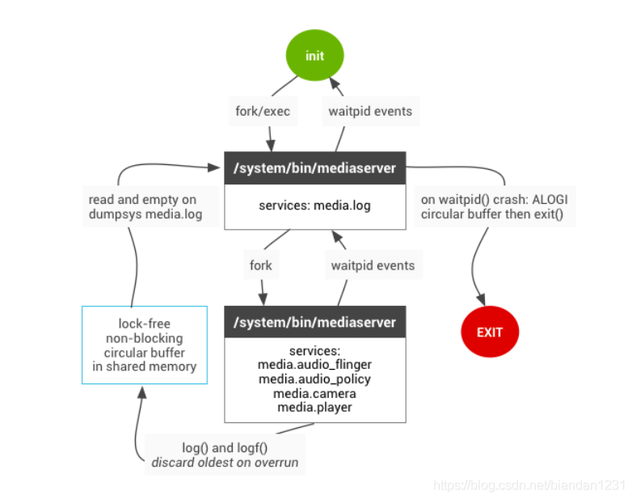
> mediaserver 包含啥

# 初始化步骤简介

1、通过init进程fork出来，从而开始各自服务的初始化
2、首先初始化audioflinger服务
3、其次初始化audiopolicyservice服务
4、进一步通过audiopolicyservice和audioflinger完成音频hal层的初始化 

1、通过init进程fork出来，从而开始各自服务的初始化
来，看下它是怎么定义：

```
//frameworks/av/media/audioserver/audioserver.rc
service audioserver /system/bin/audioserver
    class core
    user audioserver
    onrestart restart audio-hal-2-0
    ioprio rt 4 //设置io优先级
    disabled
```

可以看到audioserver属于core类型，优于一般的main类型，也就是说它的启动是更早的。
audioflinger&audiopolicyserver启动：

```c++
//frameworks/av/media/audioserver/main_audioserver.cpp
int main(int argc __unused, char **argv)
{

     android::hardware::configureRpcThreadpool(4, false /*callerWillJoin*/);
     sp<ProcessState> proc(ProcessState::self());
     sp<IServiceManager> sm = defaultServiceManager();
     ALOGI("ServiceManager: %p", sm.get());
     AudioFlinger::instantiate();
     AudioPolicyService::instantiate(); 

}
```

 **2、首先初始化audioflinger服务**
AudioFlinger初始化比较简洁，就是创建服务并将自身注册到systemserver中去，其次就是初始化部分通信组件以便后续与audio hal层进行通讯。如下图所示： 

 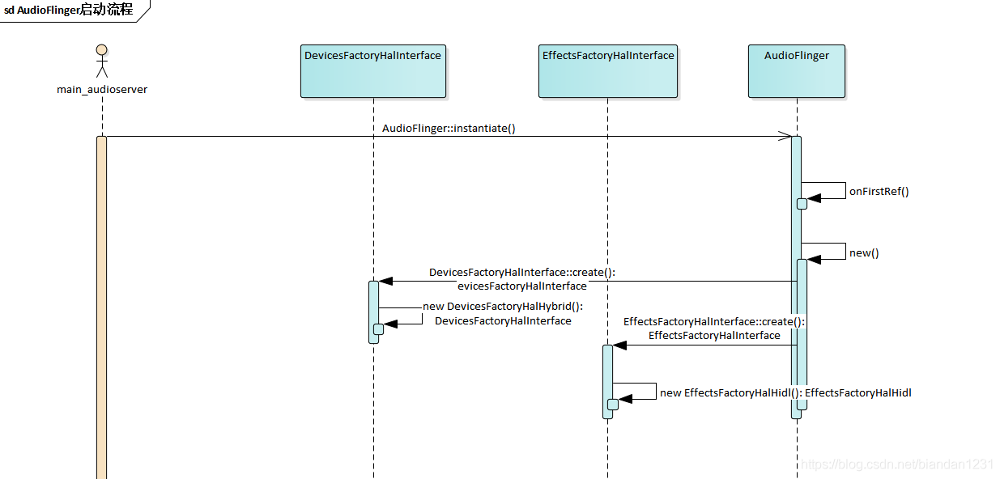 

3、其次初始化audiopolicyservice服务
AudioPolicyService的初始化就比audioflinger服务初始化复杂了，下图仅仅是audiopolicyservice与audiopolicymanager的初始化。主要就是创建出几个线程（AudioCommandThread类型的线程），以便后续与上层进行交互使用，上层调用的比如播放暂停的操作指令会进入这个线程队列，实现上层异步调用也可以防止底层耗时操作导致阻塞上层应用。接着便是创建AudioPolicyManager实例以及客户端等。大概流程如下图所示：

 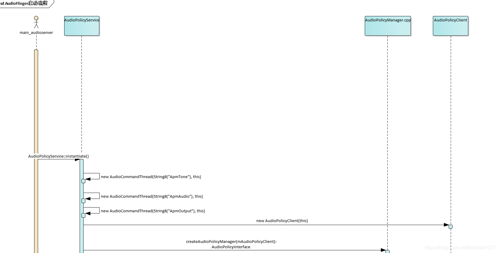 

4、进一步通过audiopolicyservice和audioflinger完成音频hal层的初始化，这部分将是本文的重点难点分析。

audiopolicyservice启动后，开始创建audiopolicymanager，并通过audiopolicymanager初始化audiopolicy策略，然后再进行对audio路由引擎（EngineInstance）进行初始化，初始化完路由引擎后便对audio hal 的so进行加载初始化，进一步通过加载后的so针对音频设备进行open操作，并默认打开主通道的输出音频流，最后将成功初始化的音频设备进行保存到audiopolicymanager以及audioflinger中，最后完成初始化。
详细的初始化流程如下图所示：
 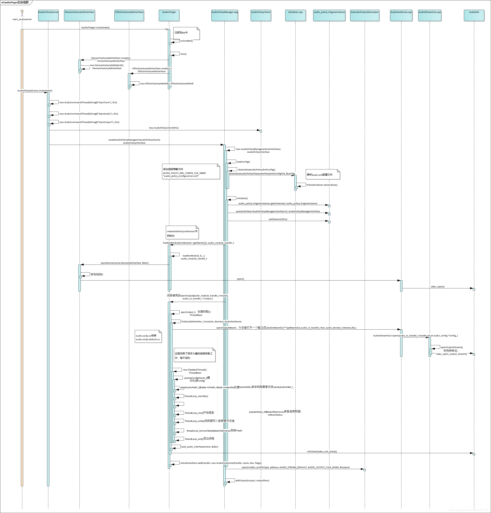 

初始化步骤详细流程分析
从上面的初始大概流程可以知道，audio框架的初始化重点在audiopolicy部分的初始化，它不仅需要初始音频策略，还需针对加载的音频策略针对hal层的音频设备进行初始化，这部分还涉及到audioflinger部分，但以audiopolicy作为主线进行分析，下面将一步步对其进行分析。

```c++
//frameworks/av/services/audiopolicy/managerdefault/AudioPolicyManager.cpp
AudioPolicyManager::AudioPolicyManager(AudioPolicyClientInterface *clientInterface)
        : AudioPolicyManager(clientInterface, false /*forTesting*/)
{
	//1、加载audiopolicy的策略文件
    loadConfig();
    //2、针对加载的策略进行真正的初始化
    initialize();
}

```

可以看到AudioPolicyManager构造函数很简单，就两个调用：
第一步：loadConfig（）
第二步：initialize（）

下面进入详细分析：

1、loadConfig()
很简单，就通过配置文件USE_XML_AUDIO_POLICY_CONF来控制是使用XML配置的策略文件还是使用传统旧config配置文件。这个变量的初始化可以通过配置文件进行选择。

```c++
//frameworks/av/services/audiopolicy/managerdefault/AudioPolicyManager.cpp
void AudioPolicyManager::loadConfig() {
#ifdef USE_XML_AUDIO_POLICY_CONF
	//getConfig()这个很重要，为了后续的加载so做准备
    if (deserializeAudioPolicyXmlConfig(getConfig()) != NO_ERROR) {
#else
    if ((ConfigParsingUtils::loadConfig(AUDIO_POLICY_VENDOR_CONFIG_FILE, getConfig()) != NO_ERROR)
           && (ConfigParsingUtils::loadConfig(AUDIO_POLICY_CONFIG_FILE, getConfig()) != NO_ERROR)) {
#endif
        ALOGE("could not load audio policy configuration file, setting defaults");
        getConfig().setDefault();
    }
}

```

getConfig()得到的 mConfig 变量

```c++
mConfig(mHwModulesAll, mAvailableOutputDevices, mAvailableInputDevices, mDefaultOutputDevice, 
static_cast<VolumeCurvesCollection*>(mVolumeCurves.get()))

```

 XML的配置文件格式如下（简化版配置，这块涉及到音频路由，后续将会再写一篇详细介绍该配置文件）： 

//frameworks/av/services/audiopolicy/config/audio_policy_configuration.xml 

```xml
<audioPolicyConfiguration version="1.0" xmlns:xi="http://www.w3.org/2001/XInclude">
    <globalConfiguration speaker_drc_enabled="true"/>
    <modules>
    	//编译后生成的so命名会根据module name 以及soc名字生成e.g. audio.[module name].[soc name]
    	//如IMX8的：audio.primary.imx8.so
        <module name="primary" halVersion="2.0">
            <attachedDevices>
                <item>Speaker</item>
            </attachedDevices>
            <defaultOutputDevice>Speaker</defaultOutputDevice>
            <mixPorts>//输出混音线程
                <mixPort name="primary output" role="source" flags="AUDIO_OUTPUT_FLAG_PRIMARY">
                    <profile name="" format="AUDIO_FORMAT_PCM_16_BIT" samplingRates="48000"
                    channelMasks="AUDIO_CHANNEL_OUT_STEREO"/>
                </mixPort>
            </mixPorts>
            <devicePorts>//输出设备节点
                <devicePort tagName="Speaker" type="AUDIO_DEVICE_OUT_SPEAKER" role="sink" >
                </devicePort>
            </devicePorts>
            <routes>
            	//音频路由
                <route type="mix" sink="Speaker" sources="esai output,primary output"/>
            </routes>
        </module>
    </modules>
</audioPolicyConfiguration>
```

2、initialize()
好了，上面的都是开胃菜，这个才是硬菜。
来，看下这个大概步骤，心中有谱，码海不慌。
主要是三个步骤：
2.1初始音频路由引擎
audio_policy::EngineInstance *engineInstance = audio_policy::EngineInstance::getInstance();
2.2、加载so 并且打开设备节点
mpClientInterface->loadHwModule(hwModule->getName())
2.3、打开输出流
status_t status = outputDesc->open(nullptr, profileType, address, AUDIO_STREAM_DEFAULT, AUDIO_OUTPUT_FLAG_NONE,&output);

```c++
//frameworks/av/services/audiopolicy/managerdefault/AudioPolicyManager.cpp
status_t AudioPolicyManager::initialize() {
	//1、初始音频路由引擎
    // Once policy config has been parsed, retrieve an instance of the engine and initialize it.
    audio_policy::EngineInstance *engineInstance = audio_policy::EngineInstance::getInstance();
    if (!engineInstance) {
        ALOGE("%s:  Could not get an instance of policy engine", __FUNCTION__);
        return NO_INIT;
    }
    // Retrieve the Policy Manager Interface
    mEngine = engineInstance->queryInterface<AudioPolicyManagerInterface>();
    if (mEngine == NULL) {
        ALOGE("%s: Failed to get Policy Engine Interface", __FUNCTION__);
        return NO_INIT;
    }
    mEngine->setObserver(this);
    status_t status = mEngine->initCheck();

      for (const auto& hwModule : mHwModulesAll) {
      	//2、加载so 并且打开设备节点
        hwModule->setHandle(mpClientInterface->loadHwModule(hwModule->getName()));
        mHwModules.push_back(hwModule);
        // open all output streams needed to access attached devices
        // except for direct output streams that are only opened when they are actually
        // required by an app.
        // This also validates mAvailableOutputDevices list
        for (const auto& outProfile : hwModule->getOutputProfiles()) {
            //经过一系列有效判断后 创建输出相关参数
            sp<SwAudioOutputDescriptor> outputDesc = new SwAudioOutputDescriptor(outProfile,
                                                                                 mpClientInterface);
            const DeviceVector &supportedDevices = outProfile->getSupportedDevices();
            const DeviceVector &devicesForType = supportedDevices.getDevicesFromType(profileType);
            String8 address = devicesForType.size() > 0 ? devicesForType.itemAt(0)->mAddress
                    : String8("");
            audio_io_handle_t output = AUDIO_IO_HANDLE_NONE;
            //3、打开输出流
            status_t status = outputDesc->open(nullptr, profileType, address,
                                           AUDIO_STREAM_DEFAULT, AUDIO_OUTPUT_FLAG_NONE, &output);

            if (status != NO_ERROR) {
                ALOGW("Cannot open output stream for device %08x on hw module %s",
                      outputDesc->mDevice,
                      hwModule->getName());
            } else {
                for (const auto& dev : supportedDevices) {
                    ssize_t index = mAvailableOutputDevices.indexOf(dev);
                    // give a valid ID to an attached device once confirmed it is reachable
                    if (index >= 0 && !mAvailableOutputDevices[index]->isAttached()) {
                    	//这个很重要的变量，保存了可用的输出设备，后续会进一步说明
                        mAvailableOutputDevices[index]->attach(hwModule);
                    }
                }
                if (mPrimaryOutput == 0 &&
                        outProfile->getFlags() & AUDIO_OUTPUT_FLAG_PRIMARY) {
                    mPrimaryOutput = outputDesc;
                }
                addOutput(output, outputDesc);
                setOutputDevice(outputDesc, profileType, true, 0,  NULL, address);
            }
         }//end inner for
        }//end out for
    }
    // make sure all attached devices have been allocated a unique ID

```

2.1、初始音频路由引擎
2.1.1 创建路由
audio_policy::EngineInstance
这块有可配置路由和默认路由之分，音频流是根据路由策略进行打开相应的音频路由通路的。这部分内容需要领开一篇进行分析。这是一块很重要的内容，这里暂不展开分析。

2.2、加载so 并且打开设备节点
loadHwModule(hwModule->getName())；
参数是由上面步骤初始配置文件得到，hwModule->getName()：如IMX8的根据配置文件：audio.primary.imx8.so
会在vendor/lib/hw/加载文件，如果找不到会依次在system/lib/hw/进行查找。
详细步骤如下：

```c++
//注意这个返回值是audio_module_handle_t，这是个线程，这个很重要
//因为后续的播放录音Track都是挂到这个audio_module_handle_t上去的，这个是个线程
//frameworks/av/services/audioflinger/AudioFlinger.cpp
audio_module_handle_t AudioFlinger::loadHwModule(const char *name){
//1==>进一步调用loadHwModule_l(name);
//2====> 再进一步调用到DevicesFactoryHal的openDevice方法打开驱动设备
//frameworks/av/services/audioflinger/AudioFlinger.cpp
int rc = mDevicesFactoryHal->openDevice(name, &dev);
//3=======>调用本地通讯方式的DeviceFactroy实现
//frameworks\av\media\libaudiohal\2.0\DevicesFactoryHalLocal.cpp
status_t DevicesFactoryHalLocal::openDevice(const char *name, sp<DeviceHalInterface> *device) 
//3.1=======>继续调用到load_audio_interface
//frameworks\av\media\libaudiohal\2.0\DevicesFactoryHalLocal.cpp
static status_t load_audio_interface(const char *if_name, audio_hw_device_t **dev){
    const hw_module_t *mod;
    int rc;
    rc = hw_get_module_by_class(AUDIO_HARDWARE_MODULE_ID, if_name, &mod);
    if (rc) {
        ALOGE("%s couldn't load audio hw module %s.%s (%s)", __func__,
                AUDIO_HARDWARE_MODULE_ID, if_name, strerror(-rc));
        goto out;
    }
    rc = audio_hw_device_open(mod, dev);
    return rc;
}
//4=========>最终会调用到audio.h的方法open，audio_hw_device_open方法会调用设备的open方法
//hardware/libhardware/include/hardware/audio.h
static inline int audio_hw_device_open(const struct hw_module_t* module,
                                       struct audio_hw_device** device){
    return module->methods->open(module, AUDIO_HARDWARE_INTERFACE,
                                 TO_HW_DEVICE_T_OPEN(device));
}
//5==========>最后会调用到
//最终会调用到各自厂商实现的hal层的open方法，代码路径就不放了
static int adev_open(const hw_module_t* module, const char* name,
                     hw_device_t** device)

```

mDevicesFactoryHal初始化

```c++
// mDevicesFactoryHal初始化是在AudioFlinger初始化的时候进行的：
//frameworks/av/services/audioflinger/AudioFlinger.cpp
mDevicesFactoryHal = DevicesFactoryHalInterface::create();

//frameworks/av/media/libaudiohal/DevicesFactoryHalInterface.cpp
sp<DevicesFactoryHalInterface> DevicesFactoryHalInterface::create() {
    if (hardware::audio::V4_0::IDevicesFactory::getService() != nullptr) {
        return new V4_0::DevicesFactoryHalHybrid();
    }
    if (hardware::audio::V2_0::IDevicesFactory::getService() != nullptr) {
        return new DevicesFactoryHalHybrid();
    }
    return nullptr;
}
DevicesFactoryHalHybrid：Hybrid混合，包含了本地通讯方式，也包含了HIDL通讯方式：
//frameworks/av/media/libaudiohal/impl/DevicesFactoryHalHybrid.cpp
DevicesFactoryHalHybrid::DevicesFactoryHalHybrid(sp<IDevicesFactory> hidlFactory)
        : mLocalFactory(new DevicesFactoryHalLocal()),
          mHidlFactory(new DevicesFactoryHalHidl(hidlFactory)) {
}

status_t DevicesFactoryHalHybrid::openDevice(const char *name, sp<DeviceHalInterface> *device) {
    if (mHidlFactory != 0 && strcmp(AUDIO_HARDWARE_MODULE_ID_A2DP, name) != 0 &&
        strcmp(AUDIO_HARDWARE_MODULE_ID_HEARING_AID, name) != 0) {
        return mHidlFactory->openDevice(name, device);
    }
    return mLocalFactory->openDevice(name, device);
}
//到这里，mDevicesFactoryHal的初始化介绍就完毕了。
//但是Android 10以后是mDevicesFactoryHal的初始化是这样实现的：
//frameworks/av/media/libaudiohal/DevicesFactoryHalInterface.cpp
sp<DevicesFactoryHalInterface> DevicesFactoryHalInterface::create() {
   return createPreferredImpl<DevicesFactoryHalInterface>(
            "android.hardware.audio", "IDevicesFactory");
}
//通过是从服务中根据名称"android.hardware.audio", "IDevicesFactory"获取的，暂不深究。

```

open device

```c++
//frameworks/av/services/audiopolicy/managerdefault/AudioPolicyManager.cpp  AudioPolicyManager::initialize()
 const DeviceVector &supportedDevices = outProfile->getSupportedDevices();
            const DeviceVector &devicesForType = supportedDevices.getDevicesFromType(profileType);
            String8 address = devicesForType.size() > 0 ? devicesForType.itemAt(0)->mAddress
                    : String8("");
            audio_io_handle_t output = AUDIO_IO_HANDLE_NONE;
            status_t status = outputDesc->open(nullptr, profileType, address,
                                           AUDIO_STREAM_DEFAULT, AUDIO_OUTPUT_FLAG_NONE, &output);
                                           
//frameworks/av/services/audiopolicy/common/managerdefinitions/src/AudioOutputDescriptor.cpp
status_t SwAudioOutputDescriptor::open(const audio_config_t *config,
                                       const DeviceVector &devices,
                                       audio_stream_type_t stream,
                                       audio_output_flags_t flags,
                                       audio_io_handle_t *output)
{
    mDevices = devices;
    sp<DeviceDescriptor> device = devices.getDeviceForOpening();
    LOG_ALWAYS_FATAL_IF(device == nullptr,
                        "%s failed to get device descriptor for opening "
                        "with the requested devices, all device types: %s",
                        __func__, dumpDeviceTypes(devices.types()).c_str());

    audio_config_t lConfig;
    if (config == nullptr) {
        lConfig = AUDIO_CONFIG_INITIALIZER;
        lConfig.sample_rate = mSamplingRate;
        lConfig.channel_mask = mChannelMask;
        lConfig.format = mFormat;
    } else {
        lConfig = *config;
    }

    // if the selected profile is offloaded and no offload info was specified,
    // create a default one
    if ((mProfile->getFlags() & AUDIO_OUTPUT_FLAG_COMPRESS_OFFLOAD) &&
            lConfig.offload_info.format == AUDIO_FORMAT_DEFAULT) {
        flags = (audio_output_flags_t)(flags | AUDIO_OUTPUT_FLAG_COMPRESS_OFFLOAD);
        lConfig.offload_info = AUDIO_INFO_INITIALIZER;
        lConfig.offload_info.sample_rate = lConfig.sample_rate;
        lConfig.offload_info.channel_mask = lConfig.channel_mask;
        lConfig.offload_info.format = lConfig.format;
        lConfig.offload_info.stream_type = stream;
        lConfig.offload_info.duration_us = -1;
        lConfig.offload_info.has_video = true; // conservative
        lConfig.offload_info.is_streaming = true; // likely
    }

    mFlags = (audio_output_flags_t)(mFlags | flags);

    ALOGV("opening output for device %s profile %p name %s",
          mDevices.toString().c_str(), mProfile.get(), mProfile->getName().c_str());

    status_t status = mClientInterface->openOutput(mProfile->getModuleHandle(),
                                                   output,
                                                   &lConfig,
                                                   device,
                                                   &mLatency,
                                                   mFlags);
 //mClientInterface:是在AudioPolicyManager调用的时候传进去的
 AudioPolicyClientInterface *mpClientInterface;  // audio policy client interface
```

 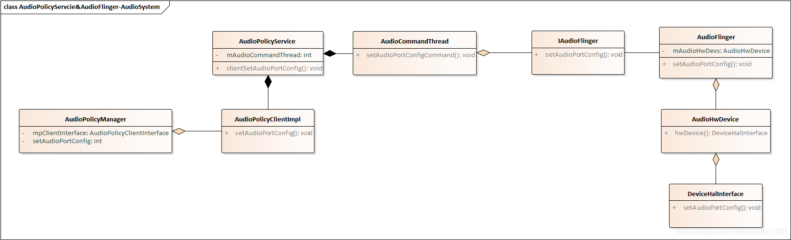 


# Audio Basic

要想知道Andorid是怎样对设备的输出输出进行控制的，我们首先来了解一些音频相关的基本知识： stream_type、content_type、devices、routing_strategy。

stream_type:音频流的类型。在当前系统中，Android(6.0)一共定义了11种stream_type以供开发者使用。Android上层开发要想要发出声音，都必须先确定当前当前的音频类型。
content_type:具体输出类型。虽然当前一共有11种stream_type,但一旦进入到Attribute，Android就只将其整理成几种类型。这才是实际的类型。
device:音频输入输出设备。Android定义了多种设备输入输出设备（具体物理设备可能还是那几个，但是输出场景不尽相同）。
routing_strategy:音频路由策略。默认情况下，Android是根据路由策略去选择设备负责输出输入音频的。


stream_type在android中java层与c++层均有定义。并且对应的值是保持一致的。

 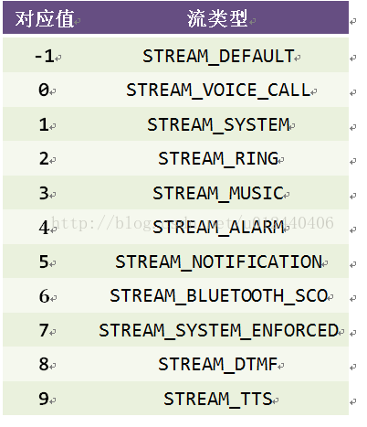 


device与stream_type一样，在java层和C++层均有定义，并且会根据使用的情况不同蕴含多个定义：

 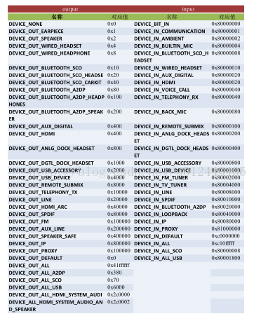 


相对stream_type，routing_strategy只是一个定义在RountingStrategy.h的一个简单的枚举结构体：

 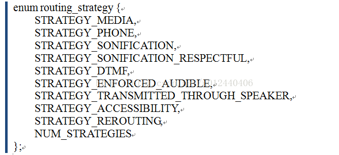 

usecase只是qcom内部定义的一个数据结构，位于hal层，用作处理处理内部声卡逻辑和输出方案。输出方案与声卡中的mixer_path_xxx.xml相联。而mixer_path等相关文件，才是具体的音频输出方案。

 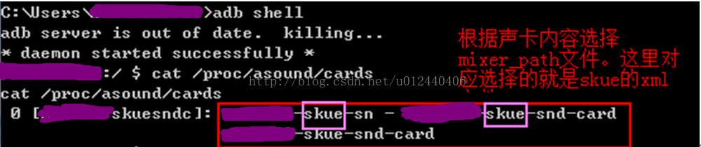 


我们通过查看当前的声卡情况确定了当前具体的mixer_path文件——mixer_path_skue.xml。xml文件内部就是我们预定义的usecase的具体情况：

在mixer_path类文件中，一个标准的path就如上面的红框那样。有名字，有一定的参数。另外，一个patch之中，还可以嵌套另外一个patch。

 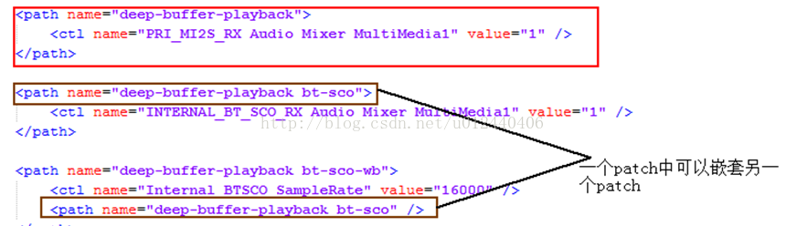 

由于usecase只是目前高通hal层独有的定义，所以本文不会花太多时间和精力去探讨usecase的相关设置和内容。目前来说，对这个有一定的认知就可。


路由选择简单流程

 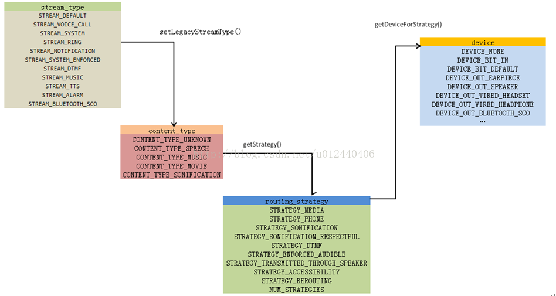 


# AudioPolicy

 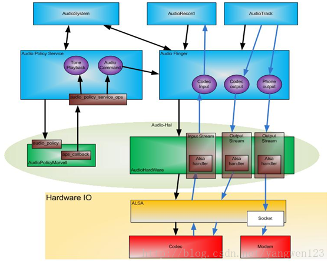 


# AudioPolicy配置

 output 0, output 1, output 2…
input 0, input 1, input 2…
xml中配置的一个mixPort对应一个output或者input
xml中role配置为source的为output，role配置为sink的为input（请看中间MIX部分）
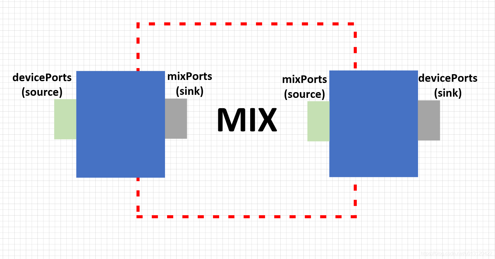 

# Policy 配置


//device/google/coral/audio/audio_policy_configuration.xml一般自定义的应该放到device目录下

```
<audioPolicyConfiguration version="1.0" xmlns:xi="http://www.w3.org/2001/XInclude">
    <globalConfiguration speaker_drc_enabled="true"/>
    <modules>
        <module name="primary" halVersion="2.0">
            <attachedDevices>//设备类型在这里插入代码片
                <item>Speaker</item>
                <item>Built-In Mic</item>
            </attachedDevices>
            <defaultOutputDevice>Speaker</defaultOutputDevice>
            <mixPorts>//混音端口（混音线程）
                <mixPort name="primary output" role="source" flags="AUDIO_OUTPUT_FLAG_PRIMARY">
                    <profile name="" format="AUDIO_FORMAT_PCM_16_BIT"
                             samplingRates="48000" channelMasks="AUDIO_CHANNEL_OUT_STEREO"/>
                </mixPort>
                <mixPort name="primary input" role="sink">
                    <profile name="" format="AUDIO_FORMAT_PCM_16_BIT"
                             samplingRates="8000,11025,16000,22050,24000,32000,44100,48000"
                             channelMasks="AUDIO_CHANNEL_IN_MONO,AUDIO_CHANNEL_IN_STEREO"/>
                </mixPort>
            </mixPorts>
            <devicePorts>//设备端口
     			 <devicePort tagName="Music" type="AUDIO_DEVICE_OUT_BUS" role="sink" address="bus0">
                    <profile name="" format="AUDIO_FORMAT_PCM_16_BIT"
                             samplingRates="48000" channelMasks="AUDIO_CHANNEL_OUT_MONO,AUDIO_CHANNEL_OUT_STEREO"/>
                    <gains>
                        <gain name="" mode="AUDIO_GAIN_MODE_JOINT"
                              minValueMB="0" maxValueMB="4000" defaultValueMB="2000" stepValueMB="100"/>
                    </gains>
                </devicePort>
                <devicePort tagName="Speaker" type="AUDIO_DEVICE_OUT_SPEAKER" role="sink" 
                address="bus0">//android 原生是没有address配置的，type类型需要使用bus类型才能生效
                </devicePort>
                </devicePort>
                <devicePort tagName="HDMI Out" type="AUDIO_DEVICE_OUT_AUX_DIGITAL" role="sink"  
                address="bus0">
                </devicePort>
                <devicePort tagName="Built-In Mic" type="AUDIO_DEVICE_IN_BUILTIN_MIC" role="source">
                </devicePort>
                 <devicePort tagName="FM Tuner" type="AUDIO_DEVICE_IN_BUS" role="source" address="tuner0">
                    <profile name="" format="AUDIO_FORMAT_PCM_16_BIT"
                             samplingRates="48000"
                             channelMasks="AUDIO_CHANNEL_IN_MONO,AUDIO_CHANNEL_IN_STEREO"/>
                    <gains>
                        <gain name="" mode="AUDIO_GAIN_MODE_JOINT"
                              minValueMB="0" maxValueMB="4000" defaultValueMB="1000" stepValueMB="100"/>
                    </gains>
                </devicePort>
                <devicePort tagName="Voice Call" type="AUDIO_DEVICE_IN_BUS" role="source" address="voice_call">
                    <profile name="" format="AUDIO_FORMAT_PCM_16_BIT"
                             samplingRates="48000"
                             channelMasks="AUDIO_CHANNEL_IN_MONO,AUDIO_CHANNEL_IN_STEREO"/>
                    <gains>
                        <gain name="" mode="AUDIO_GAIN_MODE_JOINT"
                              minValueMB="0" maxValueMB="4000" defaultValueMB="1000" stepValueMB="100"/>
                    </gains>
                </devicePort>
            </devicePorts>
            <routes>//路由
                <route type="mix" sink="Speaker"
                       sources="esai output,primary output"/>
                <route type="mix" sink="Wired Headphones"
                       sources="primary output"/>
                <route type="mix" sink="HDMI Out"
                       sources="primary output"/>

                <route type="mix" sink="primary input"
                       sources="Built-In Mic,Wired Headset Mic,Spdif-In"/>
            </routes>
        </module>
    </modules>
</audioPolicyConfiguration>

```


# 外围设备

 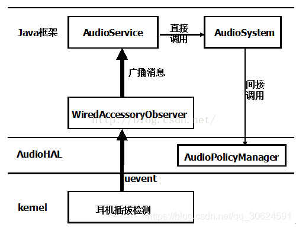 

AudioService创建AudioServiceBroadcastReceiver实例并通过IntentFilter注册监听ACTION_HEADSET_PLUG，当接收到ACTION_HEADSET_PLUG后调AudioSystem.setDeviceConnectionState()设置音频设备连接状态，AudioSystem.setDeviceConnectionState()最终将调用到Audio硬件抽象层的AudioPolicyManager，通过音频策略模块改变音频输出通道，从而实现扬声器与耳机输出切换。
