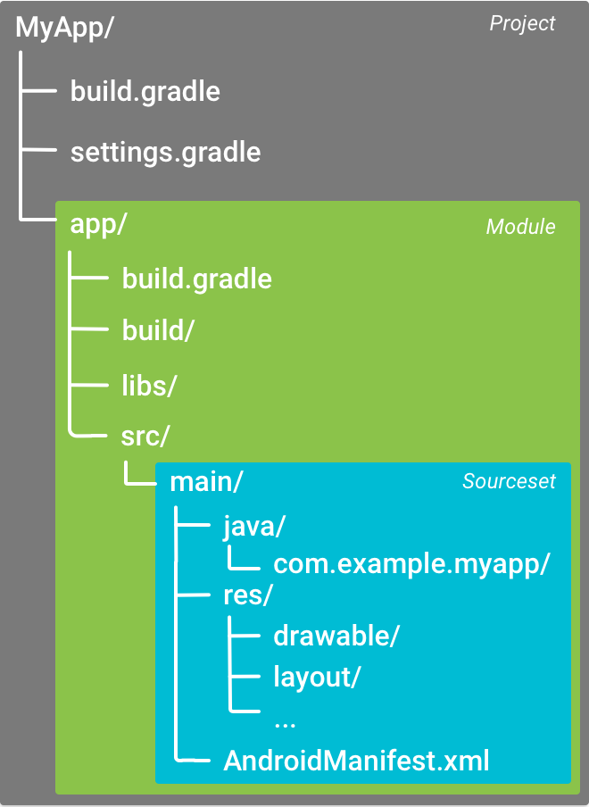

# Gradle介绍

> [Gradle user  guide]([What is Gradle?](https://docs.gradle.org/current/userguide/what_is_gradle.html#five_things))

Gradle is an open-source [build automation](https://en.wikipedia.org/wiki/Build_automation) tool that is designed to be flexible enough to build almost any type of software. The following is a high-level overview of some of its most important features:

- High performance

  Gradle avoids unnecessary work by only running the tasks that need to run because their inputs or outputs have changed. You can also use a build cache to enable the reuse of task outputs from previous runs or even from a different machine (with a shared build cache).There are many other optimizations that Gradle implements and the development team continually work to improve Gradle’s performance.

- JVM foundation

  Gradle runs on the JVM and you must have a Java Development Kit (JDK) installed to use it. This is a bonus for users familiar with the Java platform as you can use the standard Java APIs in your build logic, such as custom task types and plugins. It also makes it easy to run Gradle on different platforms.Note that Gradle isn’t limited to building just JVM projects, and it even comes packaged with support for building native projects.

- Conventions

  Gradle takes a leaf out of Maven’s book and makes common types of projects — such as Java projects — easy to build by implementing conventions. Apply the appropriate plugins and you can easily end up with slim build scripts for many projects. But these conventions don’t limit you: Gradle allows you to override them, add your own tasks, and make many other customizations to your convention-based builds.

- Extensibility

  You can readily extend Gradle to provide your own task types or even build model. See the Android build support for an example of this: it adds many new build concepts such as flavors and build types.

- IDE support

  Several major IDEs allow you to import Gradle builds and interact with them: Android Studio, IntelliJ IDEA, Eclipse, and NetBeans. Gradle also has support for generating the solution files required to load a project into Visual Studio.

- Insight

  [Build scans](https://scans.gradle.com/) provide extensive information about a build run that you can use to identify build issues. They are particularly good at helping you to identify problems with a build’s performance. You can also share build scans with others, which is particularly useful if you need to ask for advice in fixing an issue with the build.


## [Five things you need to know about Gradle](https://docs.gradle.org/current/userguide/what_is_gradle.html#five_things)

Gradle is a flexible and powerful build tool that can easily feel intimidating when you first start. However, understanding the following core principles will make Gradle much more approachable and you will become adept with the tool before you know it.

### [1. Gradle is a general-purpose build tool](https://docs.gradle.org/current/userguide/what_is_gradle.html#1_gradle_is_a_general_purpose_build_tool)

Gradle allows you to build any software, because it makes few assumptions about what you’re trying to build or how it should be done. The most notable restriction is that dependency management currently only supports Maven- and Ivy-compatible repositories and the filesystem.

This doesn’t mean you have to do a lot of work to create a build. Gradle makes it easy to build common types of project — say Java libraries — by adding a layer of conventions and prebuilt functionality through [*plugins*](https://docs.gradle.org/current/userguide/plugins.html#plugins). You can even create and publish custom plugins to encapsulate your own conventions and build functionality.

### [2. The core model is based on tasks](https://docs.gradle.org/current/userguide/what_is_gradle.html#the_core_model_is_based_on_tasks)

Gradle models its builds as Directed Acyclic Graphs (DAGs) of tasks (units of work). What this means is that a build essentially configures a set of tasks and wires them together — based on their dependencies — to create that DAG. Once the task graph has been created, Gradle determines which tasks need to be run in which order and then proceeds to execute them.

This diagram shows two example task graphs, one abstract and the other concrete, with the dependencies between the tasks represented as arrows:


Figure 1. Two examples of Gradle task graphs

Almost any build process can be modeled as a graph of tasks in this way, which is one of the reasons why Gradle is so flexible. And that task graph can be defined by both plugins and your own build scripts, with tasks linked together via the [task dependency mechanism](https://docs.gradle.org/current/userguide/tutorial_using_tasks.html#sec:task_dependencies).

**Tasks themselves consist of:**

- Actions — pieces of work that do something, like copy files or compile source
- Inputs — values, files and directories that the actions use or operate on
- Outputs — files and directories that the actions modify or generate

In fact, all of the above are optional depending on what the task needs to do. Some tasks — such as the [standard lifecycle tasks](https://docs.gradle.org/current/userguide/base_plugin.html#sec:base_tasks) — don’t even have any actions. They simply aggregate multiple tasks together as a convenience.

|      | You choose which task to run. Save time by specifying the task that does what you need, but no more than that. If you just want to run the unit tests, choose the task that does that — typically `test`. If you want to package an application, most builds have an `assemble` task for that. |
| ---- | ------------------------------------------------------------ |
|      |                                                              |

One last thing: Gradle’s [incremental build](https://docs.gradle.org/current/userguide/more_about_tasks.html#sec:up_to_date_checks) support is robust and reliable, so keep your builds running fast by avoiding the `clean` task unless you actually do want to perform a clean.

### [3. Gradle has several fixed build phases](https://docs.gradle.org/current/userguide/what_is_gradle.html#3_gradle_has_several_fixed_build_phases)

It’s important to understand that Gradle evaluates and executes build scripts in three phases:

1. Initialization

   Sets up the environment for the build and determine which projects will take part in it.

2. Configuration

   Constructs and configures the task graph for the build and then determines which tasks need to run and in which order, based on the task the user wants to run.

3. Execution

   Runs the tasks selected at the end of the configuration phase.

These phases form Gradle’s [Build Lifecycle](https://docs.gradle.org/current/userguide/build_lifecycle.html#build_lifecycle).

|      | Comparison to Apache Maven terminologyGradle’s build phases are not like Maven’s phases. Maven uses its phases to divide the build execution into multiple stages. They serve a similar role to Gradle’s task graph, although less flexibly.Maven’s concept of a build lifecycle is loosely similar to Gradle’s [lifecycle tasks](https://docs.gradle.org/current/userguide/base_plugin.html#sec:base_tasks). |
| ---- | ------------------------------------------------------------ |
|      |                                                              |

Well-designed build scripts consist mostly of [declarative configuration rather than imperative logic](https://docs.gradle.org/current/userguide/authoring_maintainable_build_scripts.html#sec:avoid_imperative_logic_in_scripts). That configuration is understandably evaluated during the configuration phase. Even so, many such builds also have task actions — for example via `doLast {}` and `doFirst {}` blocks — which are evaluated during the execution phase. This is important because code evaluated during the configuration phase won’t see changes that happen during the execution phase.

Another important aspect of the configuration phase is that everything involved in it is evaluated *every time the build runs*. That is why it’s best practice to [avoid expensive work during the configuration phase](https://docs.gradle.org/current/userguide/authoring_maintainable_build_scripts.html#sec:minimize_logic_executed_configuration_phase). [Build scans](https://scans.gradle.com/) can help you identify such hotspots, among other things.

### [4. Gradle is extensible in more ways than one](https://docs.gradle.org/current/userguide/what_is_gradle.html#4_gradle_is_extensible_in_more_ways_than_one)

It would be great if you could build your project using only the build logic bundled with Gradle, but that’s rarely possible. Most builds have some special requirements that mean you need to add custom build logic.

Gradle provides several mechanisms that allow you to extend it, such as:

- [Custom task types](https://docs.gradle.org/current/userguide/custom_tasks.html#custom_tasks).

  When you want the build to do some work that an existing task can’t do, you can simply write your own task type. It’s typically best to put the source file for a custom task type in the [*buildSrc*](https://docs.gradle.org/current/userguide/organizing_gradle_projects.html#sec:build_sources) directory or in a packaged plugin. Then you can use the custom task type just like any of the Gradle-provided ones.

- Custom task actions.

  You can attach custom build logic that executes before or after a task via the [Task.doFirst()](https://docs.gradle.org/current/dsl/org.gradle.api.Task.html#org.gradle.api.Task:doFirst(org.gradle.api.Action)) and [Task.doLast()](https://docs.gradle.org/current/dsl/org.gradle.api.Task.html#org.gradle.api.Task:doLast(org.gradle.api.Action)) methods.

- [Extra properties](https://docs.gradle.org/current/userguide/writing_build_scripts.html#sec:extra_properties) on projects and tasks.

  These allows you to add your own properties to a project or task that you can then use from your own custom actions or any other build logic. Extra properties can even be applied to tasks that aren’t explicitly created by you, such as those created by Gradle’s core plugins.

- Custom conventions.

  Conventions are a powerful way to simplify builds so that users can understand and use them more easily. This can be seen with builds that use standard project structures and naming conventions, such as [Java builds](https://docs.gradle.org/current/userguide/building_java_projects.html#building_java_projects). You can write your own plugins that provide conventions — they just need to configure default values for the relevant aspects of a build.

- [A custom model](https://docs.gradle.org/current/userguide/implementing_gradle_plugins.html#modeling_dsl_like_apis).

  Gradle allows you to introduce new concepts into a build beyond tasks, files and dependency configurations. You can see this with most language plugins, which add the concept of [*source sets*](https://docs.gradle.org/current/userguide/building_java_projects.html#sec:java_source_sets) to a build. Appropriate modeling of a build process can greatly improve a build’s ease of use and its efficiency.

### [5. Build scripts operate against an API](https://docs.gradle.org/current/userguide/what_is_gradle.html#5_build_scripts_operate_against_an_api)

It’s easy to view Gradle’s build scripts as executable code, because that’s what they are. But that’s an implementation detail: well-designed build scripts describe ***what* steps are needed to build the software**, not *how* those steps should do the work. That’s a job for custom task types and plugins.

|      | There is a common misconception that Gradle’s power and flexibility come from the fact that its build scripts are code. This couldn’t be further from the truth. It’s the underlying model and API that provide the power. As we recommend in our best practices, you should [avoid putting much, if any, imperative logic in your build scripts](https://docs.gradle.org/current/userguide/authoring_maintainable_build_scripts.html#sec:avoid_imperative_logic_in_scripts). |
| ---- | ------------------------------------------------------------ |
|      |                                                              |

Yet there is one area in which it is useful to view a build script as executable code: in understanding how the syntax of the build script maps to Gradle’s API. The API documentation — **formed of the [Groovy DSL Reference](https://docs.gradle.org/current/dsl/) and the [Javadocs](https://docs.gradle.org/current/javadoc/) — lists methods and properties, and refers to closures and actions**. What do these mean within the context of a build script? Check out the [Groovy Build Script Primer](https://docs.gradle.org/current/userguide/groovy_build_script_primer.html#groovy_build_script_primer) to learn the answer to that question so that you can make effective use of the API documentation.

|      | As Gradle runs on the JVM, build scripts can also use the standard [Java API](https://docs.oracle.com/javase/8/docs/api). Groovy build scripts can additionally use the Groovy APIs, while Kotlin build scripts can use the Kotlin ones. |
| ---- | ------------------------------------------------------------ |
|      |                                                              |

# 构建流程


 **图 1.** 典型 Android 应用模块的构建流程。


典型 Android 应用模块的构建流程（如图 1 所示）按照以下常规步骤执行：

1. 编译器将您的源代码转换成 DEX 文件（Dalvik 可执行文件，其中包括在 Android 设备上运行的字节码），并将其他所有内容转换成编译后的资源。
2. 打包器将 DEX 文件和编译后的资源组合成 APK 或 AAB（具体取决于所选的 build 目标）。 必须先为 APK 或 AAB 签名，然后才能将应用安装到 Android 设备或分发到 Google Play 等商店。
3. 打包器使用调试或发布密钥库为 APK 或 AAB 签名：
   1. 如果您构建的是调试版应用（即专门用来测试和分析的应用），则打包器会使用调试密钥库为应用签名。Android Studio 会自动使用调试密钥库配置新项目。
   2. 如果您构建的是打算对外发布的发布版应用，则打包器会使用发布密钥库（您需要进行配置）为应用签名。如需创建发布密钥库，请参阅[在 Android Studio 中为应用签名](https://developer.android.google.cn/studio/publish/app-signing?hl=zh-cn#studio)。
4. 在生成最终 APK 之前，打包器会使用 [zipalign](https://developer.android.google.cn/studio/command-line/zipalign?hl=zh-cn) 工具对应用进行优化，以减少其在设备上运行时所占用的内存。

构建流程结束时，您将获得应用的调试版或发布版 APK/AAB，以用于部署、测试或向外部用户发布。


# Android build 术语表

Gradle 和 Android 插件可帮助您完成 build 以下方面的配置：

- build 类型

  build 类型定义 Gradle 在构建和打包应用时使用的某些属性，通常针对开发生命周期的不同阶段进行配置。例如，调试 build 类型会启用调试选项，并会使用调试密钥为应用签名；而发布 build 类型则可能会缩减应用大小、对应用进行混淆处理，并使用发布密钥为应用签名以进行分发。如需构建应用，您必须至少定义一个 build 类型。Android Studio 默认会创建调试 build 类型和发布 build 类型。要着手为应用自定义打包设置，不妨了解如何[配置 build 类型](https://developer.android.google.cn/studio/build/build-variants?hl=zh-cn#build-types)。

- 产品变种 (Product flavor)

  产品变种代表您可以向用户发布的不同应用版本，如免费版应用和付费版应用。您可以自定义产品变种以使用不同的代码和资源，同时共享并重用所有应用版本共用的部分。产品变种是可选的，您必须手动创建。如需开始创建应用的不同版本，请了解如何[配置产品变种](https://developer.android.google.cn/studio/build/build-variants?hl=zh-cn#product-flavors)。

- build 变体

  build 变体是 build 类型与产品变种的交叉产物，也是 Gradle 用来构建应用的配置。利用 build 变体，您可以在开发期间构建产品变种的调试版本，或者构建产品变种的已签名发布版本以供分发。虽然您无法直接配置 build 变体，但可以配置组成它们的 build 类型和产品变种。创建额外的 build 类型或产品变种也会产生额外的 build 变体。如需了解如何创建和管理 build 变体，请参阅[配置 build 变体](https://developer.android.google.cn/studio/build/build-variants?hl=zh-cn)概览。

- 清单 (Manifest) 条目

  您可以在 build 变体配置中为清单文件的某些属性指定值。这些 build 值会覆盖清单文件中的现有值。如果您要为应用生成多个变体，让每一个变体都具有不同的应用名称、最低 SDK 版本或目标 SDK 版本，便可运用这一技巧。当存在多个清单时，Gradle 会[合并清单设置](https://developer.android.google.cn/static/studio/build/manage-manifests?hl=zh-cn#merge-manifests)。

- *依赖项*

  构建系统会管理来自本地文件系统以及来自远程代码库的项目依赖项。这样一来，您就不必手动搜索、下载依赖项的二进制文件包以及将它们复制到项目目录中。如需了解详情，请参阅[添加 build 依赖项](https://developer.android.google.cn/studio/build/dependencies?hl=zh-cn)。

- 签名

  构建系统既允许您在 build 配置中指定签名设置，也可以在构建流程中自动为应用签名。构建系统通过已知凭据使用默认密钥和证书为调试版本签名，以避免在构建时提示输入密码。除非您为此 build 明确定义签名配置，否则，构建系统不会为发布版本签名。如果您没有发布密钥，可以按[为应用签名](https://developer.android.google.cn/studio/publish/app-signing?hl=zh-cn)中所述生成一个。

- 代码和资源缩减

  构建系统允许您为每个 build 变体指定不同的 ProGuard 规则文件。在构建应用时，构建系统会应用一组适当的规则以使用其内置的缩减工具（如 R8）[缩减您的代码和资源](https://developer.android.google.cn/studio/build/shrink-code?hl=zh-cn)。

- *多 APK 支持*

  通过构建系统可以自动构建不同的 APK，并让每个 APK 只包含特定屏幕密度或应用二进制接口 (ABI) 所需的代码和资源。如需了解详情，请参阅[构建多个 APK](https://developer.android.google.cn/studio/build/configure-apk-splits?hl=zh-cn)。请注意，我们建议的方法是发布单个 AAB，因为它除了让您可以按屏幕密度和 ABI 进行拆分以外，还可以让您按语言进行拆分，同时还可以降低因必须上传多个工件到 Google Play 所造成的复杂性。

## build 配置文件

创建自定义 build 配置需要您对一个或多个 build 配置文件（即 `build.gradle` 文件）做出更改。这些纯文本文件使用领域特定语言 (DSL) 以 [Groovy](http://groovy-lang.org/) 描述和操纵构建逻辑，其中 Groovy 是一种适用于 Java 虚拟机 (JVM) 的动态语言。您无需了解 Groovy 便可着手配置 build，因为 Android Plugin for Gradle 引入了您需要的大多数 DSL 元素。如需详细了解 Android 插件 DSL，请参阅 [DSL 参考文档](https://developer.android.google.cn/reference/tools/gradle-api?hl=zh-cn)。

开始新项目时，Android Studio 会自动为您创建其中的部分文件（如图 2 所示），并为其填充合理的默认值。



**图 2.** Android 应用模块的默认项目结构。


有一些 Gradle build 配置文件是 Android 应用的标准项目结构的组成部分。您必须了解其中每个文件的范围和用途及其应定义的基础 DSL 元素，才能着手配置 build。


### Gradle 设置文件

`settings.gradle` 文件位于项目的根目录下，用于定义项目级代码库设置，并告知 Gradle 在构建应用时应将哪些模块包含在内。对于大多数项目，该文件默认如下所示：

```groovy
pluginManagement {

    /**
     * The pluginManagement {repositories {...}} block configures the
     * repositories Gradle uses to search or download the Gradle plugins and
     * their transitive dependencies. Gradle pre-configures support for remote
     * repositories such as JCenter, Maven Central, and Ivy. You can also use
     * local repositories or define your own remote repositories. The code below
     * defines the Gradle Plugin Portal, Google's Maven repository,
     * and the Maven Central Repository as the repositories Gradle should use to look for its dependencies.
     */

    repositories {
        gradlePluginPortal()
        google()
        mavenCentral()
    }
}
dependencyResolutionManagement {

    /**
     * The dependencyResolutionManagement { repositories {...}}
     * block is where you configure the repositories and dependencies used by
     * all modules in your project, such as libraries that you are using to
     * create your application. However, you should configure module-specific
     * dependencies in each module-level build.gradle file. For new projects,
     * Android Studio includes Google's Maven repository
     * and the Maven Central Repository by
     * default, but it does not configure any dependencies (unless you select a
     * template that requires some).
     */

    repositoriesMode.set(RepositoriesMode.FAIL_ON_PROJECT_REPOS)
    repositories {
        google()
        mavenCentral()
    }
}
rootProject.name = "My Application"
include ‘:app’
```


### 顶层 build 文件

顶层 `build.gradle` 文件位于项目的根目录下，用于定义适用于项目中所有模块的依赖项。默认情况下，顶层 build 文件使用 `plugins` 代码块定义项目中**所有模块共用的 Gradle 依赖项**。此外，顶层 build 文件还包含用于清理 build 目录的代码。以下代码示例说明了创建新项目后可在顶层 `build.gradle` 文件中找到的默认设置和 DSL 元素。

```groovy
plugins {

    /**
     * You should use `apply false` in the top-level build.gradle file
     * to add a Gradle plugin as a build dependency, but not apply it to the
     * current (root) project. You should not use `apply false` in sub-projects.
     * For more information, see
     * Applying external plugins with same version to subprojects.
     */

    id 'com.android.application' version '7.2.0' apply false
    id 'com.android.library' version '7.2.0' apply false
    id 'org.jetbrains.kotlin.android' version '1.6.10' apply false
}

task clean(type: Delete) {
    delete rootProject.buildDir
}
```


#### 配置项目全局属性

对于包含多个模块的 Android 项目，可能有必要在**项目级别定义某些属性并在所有模块之间共享这些属性**。为此，您可以将[额外的属性](https://docs.gradle.org/current/userguide/writing_build_scripts.html#sec:extra_properties)添加到顶层 `build.gradle` 文件内的 `ext` 代码块中。

```groovy
// This block encapsulates custom properties and makes them available to all
// modules in the project. The following are only a few examples of the types
// of properties you can define.
ext {
    sdkVersion = 28
    // You can also create properties to specify versions for dependencies.
    // Having consistent versions between modules can avoid conflicts with behavior.
    supportLibVersion = "28.0.0"
    ...
}
...
```


如需从同一项目中的模块访问这些属性，请在该模块的 `build.gradle` 文件（您可以在下一部分中详细了解此文件）中使用以下语法。

```groovy
android {
    // Use the following syntax to access properties you defined at the project level:
    // rootProject.ext.property_name
    compileSdkVersion rootProject.ext.compileSdkVersion
    ...
}
...
dependencies {
    implementation "com.android.support:appcompat-v7:${rootProject.ext.supportLibVersion}"
    ...
}
```

### 模块级 build 文件

模块级 `build.gradle` 文件位于每个 `project/module/` 目录下，用于为其所在的特定模块配置 build 设置。您可以通过配置这些 build 设置提供自定义打包选项（如额外的 build 类型和产品变种），以及覆盖 `main/` 应用清单或顶层 `build.gradle` 文件中的设置。

以下 Android 应用模块 `build.gradle` 文件示例简要说明了您应该了解的一些基础 DSL 元素和设置。

```groovy
/**
 * The first line in the build configuration applies the Android plugin for
 * Gradle to this build and makes the android block available to specify
 * Android-specific build options.
 */

plugins {
  id 'com.android.application'
}

/**
 * The android block is where you configure all your Android-specific
 * build options.
 */

android {

    /**
     * The app's namespace. Used primarily to access app resources.
     */

    namespace 'com.example.myapp'

    /**
     * compileSdkVersion specifies the Android API level Gradle should use to
     * compile your app. This means your app can use the API features included in
     * this API level and lower.
     */

    compileSdkVersion 28

    /**
     * The defaultConfig block encapsulates default settings and entries for all
     * build variants, and can override some attributes in main/AndroidManifest.xml
     * dynamically from the build system. You can configure product flavors to override
     * these values for different versions of your app.
     */

    defaultConfig {

        // Uniquely identifies the package for publishing.
        applicationId 'com.example.myapp'

        // Defines the minimum API level required to run the app.
        minSdkVersion 15

        // Specifies the API level used to test the app.
        targetSdkVersion 28

        // Defines the version number of your app.
        versionCode 1

        // Defines a user-friendly version name for your app.
        versionName "1.0"
    }

    /**
     * The buildTypes block is where you can configure multiple build types.
     * By default, the build system defines two build types: debug and release. The
     * debug build type is not explicitly shown in the default build configuration,
     * but it includes debugging tools and is signed with the debug key. The release
     * build type applies Proguard settings and is not signed by default.
     */

    buildTypes {

        /**
         * By default, Android Studio configures the release build type to enable code
         * shrinking, using minifyEnabled, and specifies the default Proguard rules file.
         */

        release {
              minifyEnabled true // Enables code shrinking for the release build type.
              proguardFiles getDefaultProguardFile('proguard-android.txt'), 'proguard-rules.pro'
        }
    }

    /**
     * The productFlavors block is where you can configure multiple product flavors.
     * This allows you to create different versions of your app that can
     * override the defaultConfig block with their own settings. Product flavors
     * are optional, and the build system does not create them by default.
     *
     * This example creates a free and paid product flavor. Each product flavor
     * then specifies its own application ID, so that they can exist on the Google
     * Play Store, or an Android device, simultaneously.
     *
     * If you declare product flavors, you must also declare flavor dimensions
     * and assign each flavor to a flavor dimension.
     */

    flavorDimensions "tier"
    productFlavors {
        free {
            dimension "tier"
            applicationId 'com.example.myapp.free'
        }

        paid {
            dimension "tier"
            applicationId 'com.example.myapp.paid'
        }
    }
}

/**
 * The dependencies block in the module-level build configuration file
 * specifies dependencies required to build only the module itself.
 * To learn more, go to Add build dependencies.
 */

dependencies {
    implementation project(":lib")
    implementation 'com.android.support:appcompat-v7:28.0.0'
    implementation fileTree(dir: 'libs', include: ['*.jar'])
}
```

### Gradle 属性文件

Gradle 还包含两个属性文件，它们位于项目的根目录下，可用于指定 Gradle 构建工具包本身的设置：

- `gradle.properties`

  您可以在其中配置项目全局 Gradle 设置，如 Gradle 守护程序的最大堆大小。如需了解详情，请参阅[构建环境](https://docs.gradle.org/current/userguide/build_environment.html)。

- `local.properties`

  为构建系统配置本地环境属性，其中包括：`ndk.dir` - NDK 的路径。此属性已被弃用。NDK 的所有下载版本都将安装在 Android SDK 目录下的 `ndk` 目录中。`sdk.dir` - SDK 的路径。`cmake.dir` - CMake 的路径。`ndk.symlinkdir` - 在 Android Studio 3.5 及更高版本中，创建指向 NDK 的符号链接，该符号链接的路径可比 NDK 安装路径短。

### 将 NDK 重新映射到较短的路径（仅限 Windows）

Windows 长路径最常见的问题就是 NDK 安装文件夹中的工具（如 `ld.exe`）会产生非常深的路径，但工具对于长路径的支持并不佳。

在 `local.properties` 中，您可以设置 `ndk.symlinkdir` 属性以请求 Gradle 插件创建指向 NDK 的符号链接。该符号链接的路径可比现有 NDK 文件夹的路径短。例如，`ndk.symlinkdir = C:\` 将生成以下符号链接：`C:\ndk\19.0.5232133`

# build.gradle自定義

```groovy
android {
    sourceSets {
        main {
            manifest.srcFile 'AndroidManifest.xml'
            java.srcDirs = ['src']
            resources.srcDirs = ['src']
            aidl.srcDirs = ['src']
            renderscript.srcDirs = ['src']
            res.srcDirs = ['res']
            assets.srcDirs = ['assets']
            jniLibs.srcDirs = ['libs']
            jni.srcDirs = ["./cpp"]
        }

}
```

## 设置Build参数

```groovy
buildConfigField "type", "variable", "0"
```


# NDK build

> https://developer.android.google.cn/studio/projects/configure-cmake


##  动态库多次引用,导致符号重定义

```groovy
packagingOptions {
    doNotStrip "*/*/libc++_shared.so"
}
```


