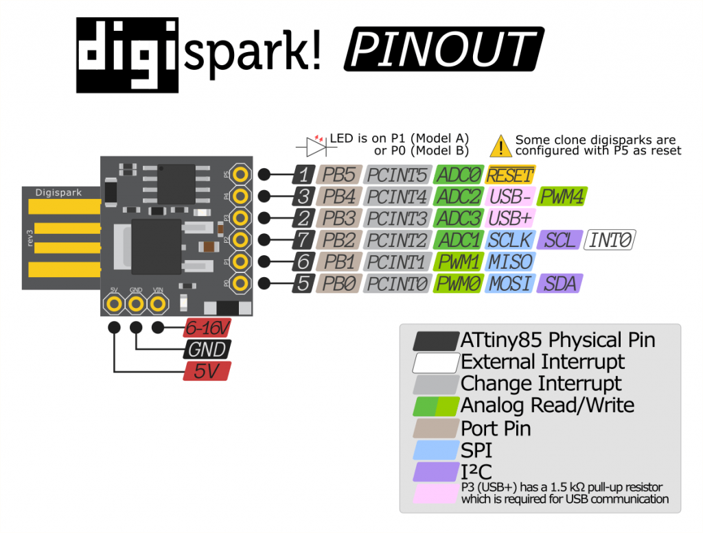
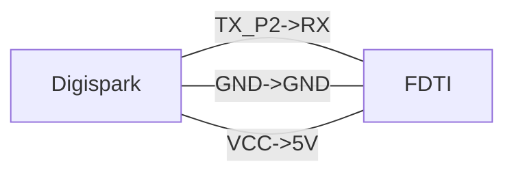
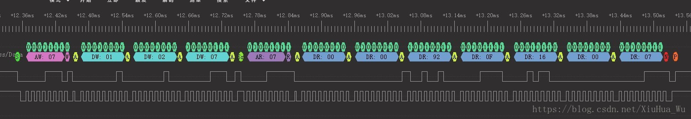

# Features

• **High Performance, Low Power AVR**® **8-Bit Microcontroller** 

• **Advanced RISC Architecture** 

**– 120 Powerful Instructions – Most Single Clock Cycle Execution** 

**– 32 x 8 General Purpose Working Registers** 

**– Fully Static Operation** 

• **Non-volatile Program and Data Memories** 

**– 2/4/8K Bytes of In-System Programmable Program Memory Flash** 

**• Endurance: 10,000 Write/Erase Cycles** 

**– 128/256/512 Bytes In-System Programmable EEPROM** 

**• Endurance: 100,000 Write/Erase Cycles** 

**– 128/256/512 Bytes Internal SRAM** 

**– Programming Lock for Self-Programming Flash Program and EEPROM Data Security** 

• **Peripheral Features** 

**– 8-bit Timer/Counter with Prescaler and Two PWM Channels** 

**– 8-bit High Speed Timer/Counter with Separate Prescaler** 

**• 2 High Frequency PWM Outputs with Separate Output Compare Registers** 

**• Programmable Dead Time Generator** 

**– USI – Universal Serial Interface with Start Condition Detector** 

**– 10-bit ADC** 

**• 4 Single Ended Channels** 

**• 2 Differential ADC Channel Pairs with Programmable Gain (1x, 20x)** 

**• Temperature Measurement** 

**– Programmable Watchdog Timer with Separate On-chip Oscillator** 

**– On-chip Analog Comparator** 

• **Special Microcontroller Features** 

**– debugWIRE On-chip Debug System** 

**– In-System Programmable via SPI Port** 

**– External and Internal Interrupt Sources** 

**– Low Power Idle, ADC Noise Reduction, and Power-down Modes** 

**– Enhanced Power-on Reset Circuit** 

**– Programmable Brown-out Detection Circuit** 

**– Internal Calibrated Oscillator** 

• **I/O and Packages** 

**– Six Programmable I/O Lines** 

**– 8-pin PDIP, 8-pin SOIC, 20-pad QFN/MLF, and 8-pin TSSOP (only ATtiny45/V)** 

• **Operating Voltage** 

**– 1.8 - 5.5V for ATtiny25V/45V/85V** 

**– 2.7 - 5.5V for ATtiny25/45/85** 

• **Speed Grade** 

**– ATtiny25V/45V/85V: 0 – 4 MHz @ 1.8 - 5.5V, 0 - 10 MHz @ 2.7 - 5.5V** 

**– ATtiny25/45/85: 0 – 10 MHz @ 2.7 - 5.5V, 0 - 20 MHz @ 4.5 - 5.5V** 

• **Industrial Temperature Range** 

• **Low Power Consumption** 

**– Active Mode:**  

**• 1 MHz, 1.8V: 300 µA** 

**– Power-down Mode:** 

**• 0.1 µA at 1.8V**


# Digistump

http://digistump.com/wiki/digispark





#  Serial Output

https://www.youtube.com/watch?v=zxmyfiFbo2c&ab_channel=AntonyCartwright

using ftdi to communicate with digispark.



```c
void setup() {
  pinMode(1, OUTPUT);
  Serial.begin(115200); 
}

// the loop routine runs over and over again forever:
void loop() {
  digitalWrite(1, HIGH);
  delay(500);
  digitalWrite(1, LOW);
  delay(500);
  Serial.println("I'm alive");
}
```

using PUTTY to connect com port and set bit


# I2C

## I2C Wire lib

http://gammon.com.au/i2c

### 背景

使用 Arduino 例程的时候发现，官方的描述不太详细，走了些弯路。特此，写篇文章记录下。

Arduino 的 I2C 相关函数
Arduino 的封装库真的是非非非常的棒，I2C 就只有 10 个 API 函数。I2C 所用的库，称为：Wire Library。详细的描述可以看这个官方地址：

https://www.arduino.cc/en/Reference/Wire

下面我会介绍部分的 API 函数。

### begin

begin 函数用于初始化 Wrie Library 并以 Master 或 Slave 的身份加入 I2C 总线上。begin 函数没有返回值。调用 begin 函数有两种形式：

begin()：无输入参数，表示以 Master 形式加入总线。
begin( address )：有输入参数，表示以从机形式加入总线，设备地址为address（7-bit）

### beginTransmission

beginTransmission 函数用于启动一次 Master write to Slave 操作。值得注意的是这个函数的调用并不会产生 Start 信号 和发送 Slave Address，仅是实现通知 Arduino后面要启动 Master write to Slave 操作。

beginTransmission 函数调用后，（再调用 write 函数进行数据写入）， 最后再调用 endTransmission 函数方能产生 Start 信号 和发送 Slave Address 及通讯时序。
beginTransmission 函数调用形式：

beginTransmission(address)
1

### write

write 函数用于向 Slave 写入数据。共有 3 种调用形式：

write(value) ：写入单字节
write(string) ：写入字符串
write(data, length) ：写入 length 个字节

### endTransmission

endTransmission 函数用于结束一次 Master write to Slave 操作。前面在介绍 beginTransmission 的时候也介绍过了，如果不在后面使用 endTransmission 函数， 总线上不会产生 Master write to Slave 的时序。

endTransmission 函数的调用十分有意思。endTransmission 函数可输入参数。

endTransmission(0)：当输入参数为 0 时，将在通讯结束后，不产生 STOP 信号。
endTransmission(!0)：当输入参数为 !0 时，在通讯结束后，生成 STOP 信号。（释放总线）
endTransmission()：当无输入参数时，在通讯结束后，产生 STOP 信号。（释放总线）
因为我设计的产品程序是使用 DUMMY WRITE 时序，就是这个不产生 STOP 信号卡了我半天的时间（这是我要写本文的原因……）。而官方中，并没有详细介绍这个输入参数…

同时，endTransmission 函数时具有返回值的：

0：success
1：data too long to fit in transmit buffer
2：received NACK on transmit of address
3：received NACK on transmit of data
4：other error
有个地方需要注意的：当通讯过程中，出现异常后，异常后的 write 操作将被终止，直接结束通讯，具体的是否出现异常，只需要看 endTransmission 的返回值即可。

### requestFrom

requestFrom 函数用于实现 Master Read From Slave 操作。调用形式有 2 种：

requestFrom(address, quantity)：从 address 设备读取 quantity 个字节，结束后，产生 STOP 信号
requestFrom(address, quantity, stop) ：从 address 设备读取 quantity 个字节，结束后，依据 stop 的值确定是否产生 STOP 信号。
stop = 0：不产生 STOP 信号
stop != 0：产生 STOP 信号
requestFrom 函数具有返回值（表示从 address 设备读取到的字节数）。

### available
available 函数用于统计 Master Read From Slave 操作后， read 缓存区剩余的字节数。每当缓存区的数据被读走 1 个字节，available 函数的返回值减一。通常 available 函数会搭配着 read 函数使用。

### read
read 函数用于在 Master Read From Slave 操作后，读取缓存区的数据。

## 例程
参考例程：
https://github.com/TFmini/TFmini-I2C-MasterExample_Arduino

### 通讯时序如下图所示：


### 节选代码段：

```c
#include <Wire.h> // I2C head file

void setup() {
  // put your setup code here, to run once:
  Serial.begin(115200);
  // Initiate the Wire library and join the I2C bus as a master or Slave.
  Wire.begin(); 
  Serial.print("Ready to Read TFmini\r\n");
  delay(10);
}

void loop() {
  // put your main code here, to run repeatedly:
  byte i = 0;
  byte rx_Num = 0;  // the bytes of received by I2C
  byte rx_buf[7] = {0}; // received buffer by I2C

  Wire.beginTransmission(7); // Begin a transmission to the I2C Slave device with the given address.
  Wire.write(1); // Reg's Address_H
  Wire.write(2); // Reg's Address_L
  Wire.write(7); // Data Length
  Wire.endTransmission(0);  // Send a START Sign

  // Wire.requestFrom（AA,BB）;receive the data form slave.
  // AA: Slave Address ; BB: Data Bytes 
  rx_Num = Wire.requestFrom(0x07, 7); 

  // Wire.available: Retuens the number of bytes available for retrieval with read().
  while( Wire.available())
  {
      rx_buf[i] = Wire.read(); // received one byte
      i++;
  }

}
```


## 总结

## I2C 设备扫描

```c
#include <Wire.h>


void setup()
{
  Wire.begin();

  Serial.begin(9600);
  while (!Serial);             // Leonardo: wait for serial monitor
  Serial.println("\nI2C Scanner");
}


void loop()
{
  byte error, address;
  int nDevices;

  Serial.println("Scanning...");

  nDevices = 0;
  for(address = 1; address < 127; address++ ) 
  {
    // The i2c_scanner uses the return value of
    // the Write.endTransmisstion to see if
    // a device did acknowledge to the address.
    Wire.beginTransmission(address);
    error = Wire.endTransmission();

    if (error == 0)
    {
      Serial.print("I2C device found at address 0x");
      if (address<16) 
        Serial.print("0");
      Serial.print(address,HEX);
      Serial.println("  !");

      nDevices++;
    }
    else if (error==4) 
    {
      Serial.print("Unknown error at address 0x");
      if (address<16) 
        Serial.print("0");
      Serial.println(address,HEX);
    }    
  }
  if (nDevices == 0)
    Serial.println("No I2C devices found\n");
  else
    Serial.println("done\n");

  delay(5000);           // wait 5 seconds for next scan
}
```

case 2

```c
// --------------------------------------
// i2c_scanner
//
// Version 1
//    This program (or code that looks like it)
//    can be found in many places.
//    For example on the Arduino.cc forum.
//    The original author is not know.
// Version 2, Juni 2012, Using Arduino 1.0.1
//     Adapted to be as simple as possible by Arduino.cc user Krodal
// Version 3, Feb 26  2013
//    V3 by louarnold
// Version 4, March 3, 2013, Using Arduino 1.0.3
//    by Arduino.cc user Krodal.
//    Changes by louarnold removed.
//    Scanning addresses changed from 0...127 to 1...119,
//    according to the i2c scanner by Nick Gammon
//    http://www.gammon.com.au/forum/?id=10896
// Version 5, March 28, 2013
//    As version 4, but address scans now to 127.
//    A sensor seems to use address 120.
//
//
// This sketch tests the standard 7-bit addresses
// Devices with higher bit address might not be seen properly.
//

#include <Wire.h>
#include <DigiKeyboard.h>

void setup()
{

  Wire.begin();
  DigiKeyboard.delay(3000);

  DigiKeyboard.println("\nI2C Scanner");
}


void loop()
{
  byte error, address;
  int nDevices;

  DigiKeyboard.println("Scanning...");

  nDevices = 0;
  for (address = 1; address < 127; address++ )
  {
    // The i2c_scanner uses the return value of
    // the Write.endTransmisstion to see if
    // a device did acknowledge to the address.
    Wire.beginTransmission(address);
    error = Wire.endTransmission();

    if (error == 0)
    {
      DigiKeyboard.print("I2C device found at address 0x");
      if (address < 16)
        DigiKeyboard.print("0");
      DigiKeyboard.print(address, HEX);
      DigiKeyboard.println("  !");

      nDevices++;
    }
    else if (error == 4)
    {
      DigiKeyboard.print("Unknow error at address 0x");
      if (address < 16)
        DigiKeyboard.print("0");
      DigiKeyboard.println(address, HEX);
    }
  }
  if (nDevices == 0)
    DigiKeyboard.println("No I2C devices found\n");
  else
    DigiKeyboard.println("done\n");

  DigiKeyboard.delay(5000);           // wait 5 seconds for next scan
}
```

# SPI

http://www.gammon.com.au/spi


# Data Sheet

 [Atmel-2586-AVR-8-bit-Microcontroller-ATtiny25-ATtiny45-ATtiny85_Datasheet.pdf](Atmel-2586-AVR-8-bit-Microcontroller-ATtiny25-ATtiny45-ATtiny85_Datasheet.pdf) 

