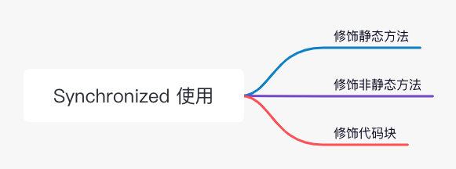
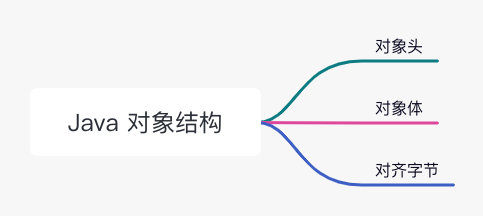
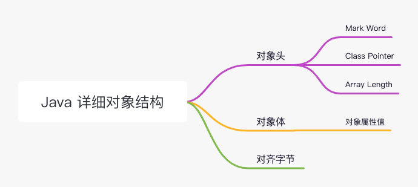
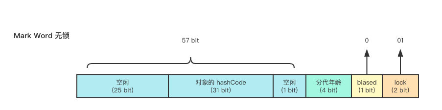
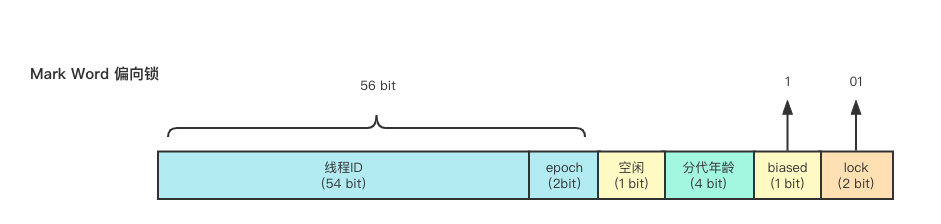
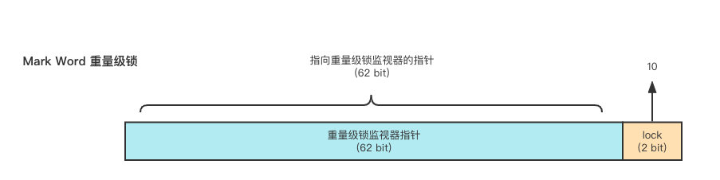
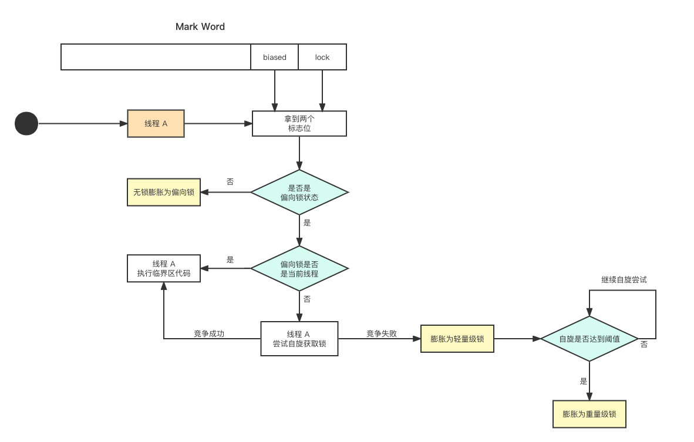

## 前言

首先，synchronized 是什么？我们需要明确的给个定义——**同步锁**，没错，它就是把**锁**。

可以用来干嘛？锁，当然当然是用于线程间的同步，以及保护临界区内的资源。我们知道，锁是个非常笼统的概念，像生活中有指纹锁、密码锁等等多个种类，那 synchronized 代表的锁具体是把什么锁呢？

答案是—— **Java 内置锁**。在 Java 中，每个**对象中**都隐藏着一把锁，而 synchronized 关键字就是激活这把隐式锁的把手（开关）。

先来简单了解一下 synchronized，我们知道其共有 **3 种**使用方式：

- 修饰静态方法：锁住当前 class，作用于该 class 的所有实例
- 修饰非静态方法：只会锁住当前 class 的实例
- 修饰代码块：该方法接受一个对象作为参数，锁住的即该对象

使用方法就不在这里赘述，可自行搜索其详细的用法，这不是本篇文章所关心的内容。

知道了 synchronized 的概念，回头来看标题，它说的**锁升级**到底是个啥？对于不太熟悉锁升级的人来说，可能会想：

> 所谓锁，不就是啪一下锁上就完事了吗？升级是个什么玩意？~~这跟打扑克牌也没关系啊。~~

对于熟悉的人来说，可能会想：

> 不就是「无锁 ==> 偏向锁 ==> 轻量级锁 ==> 重量级锁 」吗？

你可能在很多地方看到过上面描述的锁升级过程，也能直接背下来。但你真的知道**无锁**、**偏向锁**、**轻量级锁**、**重量级锁**到底代表着什么吗？这些锁存储在哪里？以及什么情况下会使得锁向下一个 level 升级？

想知道答案，我们似乎必须先搞清楚 Java 内置锁，其内部结构是啥样的？内置锁又存放在哪里？

答案在开篇提到过——在 **Java 对象**中。

那么现在的问题就从「内置锁结构是啥」变成了「Java 对象长啥样」。

## 对象结构

从**宏观**上看，Java 对象的结构很简单，分为三部分：

从**微观**上看，各个部分都还可以深入展开，详见下图：

接下来分别深入讨论一下这三部分。

### **对象头**

从脑图中可以看出，其由 Mark Word、Class Pointer、数组长度三个字段组成。简单来说：

- **Mark Word**：主要用于存储自身运行时数据
- **Class Pointer**：是指针，指向方法区中该 class 的对象，JVM 通过此字段来判断当前对象是哪个类的实例
- **数组长度**：当且仅当对象是数组时才会有该字段

Class Pointer 和数组长度没什么好说的，接下来重点聊聊 Mark Word。

Mark Word 所代表的「运行时数据」主要用来表示当前 Java 对象的线程锁状态以及 GC 的标志。而**线程锁状态**分别就是无锁、偏向锁、轻量级锁、重量级锁。

所以前文提到的这 4 个状态，其实就是 Java 内置锁的**不同状态**。

在 JDK 1.6 之前，内置锁都是**重量级锁**，效率低下。效率低下表现在

而在 JDK 1.6 之后为了提高 synchronized 的效率，才引入了**偏向锁**、**轻量级锁**。

随着锁竞争逐渐激烈，其状态会按照「无锁 ==> 偏向锁 ==> 轻量级锁 ==> 重量级锁 」这个方向逐渐升级，并且**不可逆**，只能进行锁升级，而**无法进行锁降级**。

接下来我们思考一个问题，既然 Mark Word 可以表示 4 种不同的锁状态，其内部到底是怎么区分的呢？（由于目前主流的 JVM 都是 64 位，所以我们只讨论 64 位的 Mark Word）接下来我们通过图片直观的感受一下。

#### （1）无锁

这个可以理解为单线程很快乐的运行，没有其他的线程来和其竞争。

#### （2）偏向锁

首先，什么叫偏向锁？举个例子，一段同步的代码，一直只被线程 A 访问，既然没有其他的线程来竞争，每次都要获取锁岂不是浪费资源？所以这种情况下线程 A 就会自动进入偏向锁的状态。

后续线程 A 再次访问同步代码时，不需要做任何的 check，直接执行（对该线程的「偏爱」），这样降低了获取锁的代价，提升了效率。

看到这里，你会发现无锁、偏向锁的 **lock** 标志位是一样的，即都是 **01**，这是因为无锁、偏向锁是靠字段 **biased_lock** 来区分的，0 代表没有使用偏向锁，1 代表启用了偏向锁。为什么要这么搞？你可以理解为无锁、偏向锁在本质上都可以理解为无锁（参考上面提到的线程 A 的状态），所以 lock 的标志位都是 01 是没毛病的。

> PS：这里的线程 ID 是持有当前对象偏向锁的线程

#### （3）轻量级锁

但是，一旦有第二个线程参与竞争，就会立即膨胀为**轻量级锁**。企图抢占的线程一开始会使用**自旋**：

的方式去**尝试获取锁**。如果循环几次，其他的线程释放了锁，就不需要进行用户态到内核态的切换。虽然如此，但自旋需要**占用很多 CPU 的资源**（自行理解汽车空档疯狂踩油门）。如果另一个线程 一直不释放锁，难道它就在这一直空转下去吗？

当然不可能，JDK 1.7 之前是**普通自旋**，会设定一个最大的自旋次数，**默认是 10 次**，超过这个阈值就停止自旋。JDK 1.7 之后，引入了**适应性自旋**。简单来说就是：这次自旋获取到锁了，自旋的次数就会**增加**；这次自旋没拿到锁，自旋的次数就会**减少**。

#### （4）重量级锁

上面提到，试图抢占的线程自旋达到阈值，就会**停止自旋**，那么此时锁就会膨胀成**重量级锁**。当其膨胀成重量级锁后，其他竞争的线程进来就不会自旋了，而是直接**阻塞**等待，并且 Mark Word 中的内容会变成一个**监视器（monitor）对象**，用来统一管理排队的线程。

这个 monitor 对象，每个对象都会关联一个。monitor 对象本质上是一个同步机制，保证了同时只有一个线程能够进入临界区，在 HotSpot 的虚拟机中，是由 C++ 类 ObjectMonitor 实现的。

那么 monitor 对象具体是如何来管理线程的？接下来我们看几个 ObjectMonitor 类关键的属性：

- **ContentionQueue**：是个队列，所有竞争锁的线程都会**先进入**这个队列中，可以理解为线程的统一入口，进入的线程会阻塞。
- **EntryList**：ContentionQueue 中有资格的线程会被移动到这里，相当于进行一轮初筛，进入的线程会阻塞。
- **Owner**：拥有当前 monitor 对象的线程，即 —— 持有锁的那个线程。
- **OnDeck**：与 Owner 线程进行竞争的线程，同一时刻只会有一个 OnDeck 线程在竞争。
- **WaitSet**：当 Owner 线程调用 `wait() `方法被阻塞之后，会被放到这里。当其被唤醒之后，会重新进入 EntryList 当中，这个集合的线程都会阻塞。
- **Count**：用于实现可重入锁，synchronized 是可重入的。

### **对象体**

对象体包含了当前对象的字段和值，在业务中u l是较为核心的部分。

### **对齐字节**

就是单纯用于填充的字节，没有其他的业务含义。其目的是为了保证对象所占用的内存大小为 8 的倍数，因为HotSpot VM 的内存管理要求对象的起始地址必须是 8 的倍数。

## 锁升级

了解完 4 种锁状态之后，我们就可以整体的来看一下锁升级的过程了。

线程 A 进入 synchronized 开始抢锁，JVM 会判断当前是否是偏向锁的状态，如果是就会根据 Mark Word 中存储的线程 ID 来判断，当前线程 A 是否就是持有偏向锁的线程。如果是，则忽略 check，线程 A 直接执行临界区内的代码。

但如果 Mark Word 里的线程不是线程 A，就会通过自旋尝试获取锁，如果获取到了，就将 Mark Word 中的线程 ID 改为自己的；如果竞争失败，就会立马撤销偏向锁，膨胀为轻量级锁。

后续的竞争线程都会通过自旋来尝试获取锁，如果自旋成功那么锁的状态仍然是轻量级锁。然而如果竞争失败，锁会膨胀为重量级锁，后续等待的竞争的线程都会被阻塞。

## EOF

其实偏向锁还有一个撤销的过程，也是有代价的，但相比于偏向锁带好的好处，是能够接受的。但我们这里重点的还是关注锁升级的具体逻辑和细节，关于锁升级的过程就聊到这里。